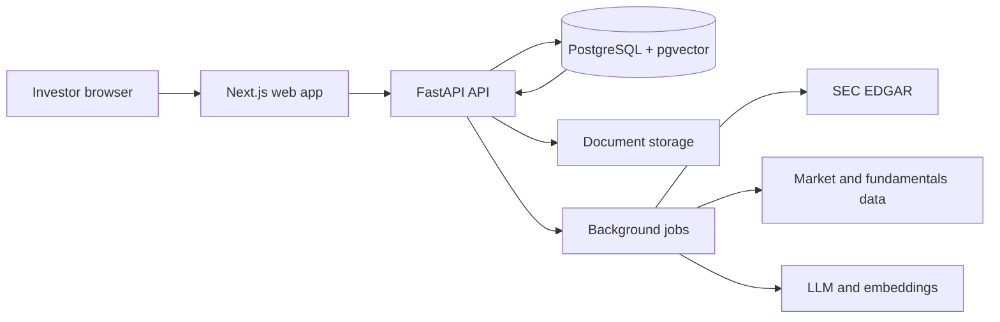

<div align="center">

# EquityLens

**Evidence-backed US equity research for individual investors.**

Connect a company's business model, value-chain position, SEC filings,
financial performance, market price, and valuation in one research workspace.


| Deploy the API | Deploy the Web app |
|---|---|
| [](https://vercel.com/new/clone?repository-url=https%3A%2F%2Fgithub.com%2FLinon419%2Fequitylens&root-directory=backend&project-name=equitylens-api&env=DATABASE_URL%2CSECRET_KEY_ACCESS_API%2COPENAI_API_KEY%2COPENAI_ORGANIZATION%2CFIRST_SUPERUSER%2CFIRST_SUPERUSER_PASSWORD%2CBLOB_READ_WRITE_TOKEN%2CMANAGED_PARSER_API_KEY%2CCORS_ORIGINS%2CDEPLOYMENT_TARGET%2COBJECT_STORAGE_PROVIDER%2CJOB_BACKEND%2CDOCUMENT_PARSER&envDefaults=%7B%22DEPLOYMENT_TARGET%22%3A%22vercel%22%2C%22OBJECT_STORAGE_PROVIDER%22%3A%22vercel_blob%22%2C%22JOB_BACKEND%22%3A%22vercel_workflow%22%2C%22DOCUMENT_PARSER%22%3A%22managed%22%7D&envDescription=Configure+the+EquityLens+API+deployment+profile+and+required+credentials.&envLink=https%3A%2F%2Fgithub.com%2FLinon419%2Fequitylens%2Fblob%2Fmain%2Fdeploy%2Fvercel%2FREADME.md) | [](https://vercel.com/new/clone?repository-url=https%3A%2F%2Fgithub.com%2FLinon419%2Fequitylens&root-directory=frontend&project-name=equitylens-web&env=NEXT_PUBLIC_API_BASE_URL&envDescription=Enter+the+production+URL+of+your+deployed+EquityLens+API.&envLink=https%3A%2F%2Fgithub.com%2FLinon419%2Fequitylens%2Fblob%2Fmain%2Fdeploy%2Fvercel%2FREADME.md) |

[Quick start](#quick-start) · [Architecture](#architecture) · [Deployment](#deployment) · [Roadmap](#roadmap) · [Contributing](#contributing)

</div>

> [!IMPORTANT]
> **Early Development / Phase 0.** The engineering foundation is operational.
> Investor accounts, automated filing retrieval, company intelligence,
> valuation workflows, and cited research answers are roadmap features.

## Why EquityLens

Retail investors often assemble company research across filings, quote pages,
spreadsheets, and disconnected notes. EquityLens is designed around one company
and six connected questions:

1. What does the company sell, and which businesses drive revenue?
2. Where does it sit in the industry value chain?
3. What do its 10-K and 10-Q filings actually say?
4. How are revenue, margins, cash flow, and balance-sheet quality changing?
5. How does the current price compare with earnings and peer valuations?
6. Which primary source supports each conclusion?

## Project status

| Capability | Status |
|---|---|
| Localized Next.js shell with browser language detection | Available |
| FastAPI application factory, provider contracts, and health endpoints | Available |
| PostgreSQL / pgvector schema managed by Alembic | Available |
| Reproducible Python and Node.js dependency locks | Available |
| Docker and Vercel deployment profiles | Available |
| User registration and authentication experience | Roadmap |
| US company, quote, fundamentals, and valuation data | Roadmap |
| Manual filing upload and automated SEC retrieval | Roadmap |
| Value-chain maps and evidence-backed RAG answers | Roadmap |

The detailed product design lives in
[`docs/superpowers/specs/2026-07-13-us-equity-research-platform-design.md`](docs/superpowers/specs/2026-07-13-us-equity-research-platform-design.md).

## Architecture



The provider contracts keep deployment-specific infrastructure at the edges:

| Profile | Web / API | Storage | Jobs | Document parsing |
|---|---|---|---|---|
| Vercel | Two Vercel Projects | Vercel Blob | Vercel Workflow | Managed parser |
| Docker | Next.js + FastAPI containers | S3-compatible storage | Redis + RQ | Local parser |

## Repository layout

```text
.
├── frontend/          # Next.js 16 and React 19 web application
├── backend/           # FastAPI API, providers, tests, and Alembic migrations
├── deploy/            # Docker and Vercel operating guides
├── docs/              # Product design, engineering plans, and reference notes
└── scripts/           # Cross-deployment smoke checks
```

## Quick start

### Prerequisites

- Python 3.12 and [uv](https://docs.astral.sh/uv/)
- Node.js 22 and Corepack
- PostgreSQL with pgvector, Redis, and S3-compatible object storage
- Docker with Compose for the full-stack container profile

### Run with Docker

```bash
cp .env.example .env
# Replace every credential placeholder in .env.
docker compose up --build --wait
./scripts/smoke.sh
```

Open `http://localhost:3000`. The API is available at
`http://localhost:8000`, with liveness and readiness endpoints under
`/api/v1/health`.

Detailed operations: [`deploy/docker/README.md`](deploy/docker/README.md).

### Run the applications natively

Copy the local backend environment template and point it at your local
PostgreSQL, Redis, and S3-compatible services:

```bash
cp backend/.env.example backend/.env
cd backend
uv sync --frozen
uv run alembic upgrade head
uv run uvicorn app.app:app --reload
```

Start the web application in a second terminal:

```bash
cd frontend
corepack pnpm install --frozen-lockfile
corepack pnpm dev
```

Browser language detection selects `/en-US` or `/zh-CN`. The language selector
stores the user's choice in a cookie.

## Deployment

### Vercel

EquityLens uses two Vercel Projects connected to the repository:

1. Deploy `backend/` with the **Deploy API** button.
2. Copy the resulting API production URL.
3. Deploy `frontend/` with the **Deploy Web** button and set
   `NEXT_PUBLIC_API_BASE_URL` to the API URL.
4. Set the API Project's `CORS_ORIGINS` to the Web production origin and
   redeploy the API.
5. Run the shared smoke check against both production origins.

The API button requests the database, authentication, OpenAI, Blob, and parser
credentials required by the Vercel profile. Deploy Button defaults contain only
public profile values.

Full environment reference: [`deploy/vercel/README.md`](deploy/vercel/README.md).

### Docker

The Docker profile runs the web app, API, worker, PostgreSQL / pgvector, Redis,
and MinIO as one Compose project. See
[`deploy/docker/README.md`](deploy/docker/README.md) for lifecycle and
troubleshooting commands.

## Health checks

| Service | Endpoint |
|---|---|
| Web | `GET /api/health` |
| API liveness | `GET /api/v1/health/live` |
| API readiness | `GET /api/v1/health/ready` |

```bash
WEB_BASE_URL=https://web.example.com \
API_BASE_URL=https://api.example.com \
./scripts/smoke.sh
```

## Quality gates

```bash
cd backend
uv lock --check
uv run pytest --cov=app.core.config --cov=app.providers \
  --cov=app.api.routes.health --cov=app.main --cov-report=term-missing
uv run ruff check app/app.py app/main.py app/core/config.py app/providers \
  app/api/deps.py app/api/main.py app/api/routes/health.py app/migrations tests

cd ../frontend
corepack pnpm install --frozen-lockfile
corepack pnpm test
corepack pnpm lint
corepack pnpm build

cd ..
git diff --check
```

## Roadmap

- User registration, sessions, and protected research workspaces
- Company search, live prices, financial statements, and valuation multiples
- SEC 10-K and 10-Q retrieval with processing status and provenance
- Manual filing uploads with storage and parsing provider support
- Business and industry value-chain mapping
- Historical and peer-relative valuation views
- Bilingual, citation-backed research conversations

## Contributing

Issues and pull requests are welcome during the early development phase.

1. Open an [issue](https://github.com/Linon419/equitylens/issues) for a feature,
   defect, or design proposal.
2. Create a focused branch and include tests or documentation for the change.
3. Run the relevant quality gates locally.
4. Open a pull request that explains the user impact and verification evidence.

## Security

- Store credentials in `.env`, Vercel Environment Variables, or your secret
  manager.
- Keep `.env` files, API keys, database URLs, and tokens out of commits and
  Deploy Button defaults.
- Report sensitive findings privately to the repository owner before opening a
  public issue.

## Acknowledgements

EquityLens builds on the original FastAPI, LangChain, PostgreSQL / pgvector,
ingestion, and infrastructure foundation from
[mazzasaverio/fastapi-langchain-rag](https://github.com/mazzasaverio/fastapi-langchain-rag).
Thank you to Saverio Mazza and the project's contributors for sharing that work.

This repository evolves the foundation into a product-specific US equity
research platform with a localized React interface, reproducible engineering
baseline, provider boundaries, database migration authority, and Vercel / Docker
deployment profiles.

## Disclaimer

EquityLens is research and educational software. Its outputs may contain errors,
delays, or incomplete information. Investment decisions require independent
verification and professional advice appropriate to the investor's situation.
