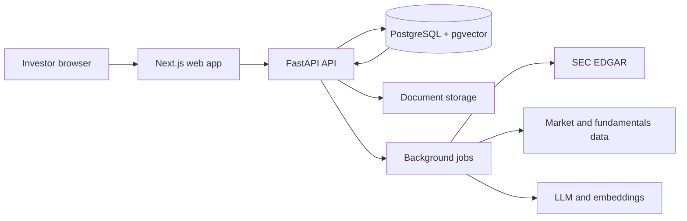

# Professional README Implementation Plan

> **For agentic workers:** REQUIRED SUB-SKILL: Use superpowers:subagent-driven-development (recommended) or superpowers:executing-plans to implement this plan task-by-task. Steps use checkbox (`- [ ]`) syntax for tracking.

**Goal:** Publish a professional, accurate English README with two verified Vercel Deploy Buttons, aligned deployment documentation, clear Phase 0 status, and upstream attribution.

**Architecture:** Treat the root README as a tested deployment interface. A focused pytest module parses the Markdown, validates Vercel query parameters and local links, and locks the project status and acknowledgement contract; supporting Vercel and frontend documentation stays concise and delegates shared instructions to the root README.

**Tech Stack:** Markdown, Mermaid, Vercel Deploy Button URL parameters, Python 3.12 standard library, pytest 8.4, Git.

---

## File Map

- Create `backend/tests/test_readme.py`: validate README identity, acknowledgement,
  local links, Deploy Button parameters, and supporting deployment names.
- Modify `README.md`: replace the Phase 0 notes with the professional repository
  landing page.
- Modify `deploy/vercel/README.md`: document the API-first two-project deployment
  flow and final CORS update.
- Modify `frontend/README.md`: replace generated framework copy with an
  EquityLens-specific component guide.
- Modify `docs/superpowers/plans/2026-07-13-professional-readme.md`: mark completed
  execution steps as work proceeds.

### Task 1: Lock the README contract with tests

**Files:**
- Create: `backend/tests/test_readme.py`

- [x] **Step 1: Write the failing README contract tests**

Create `backend/tests/test_readme.py` with:

```python
import json
import re
from pathlib import Path
from urllib.parse import parse_qs, urlparse

ROOT = Path(__file__).resolve().parents[2]
README = ROOT / "README.md"
DEPLOY_LINK = re.compile(
    r"\[!\[Deploy (?P<label>API|Web) with Vercel\]"
    r"\(https://vercel.com/button\)\]"
    r"\((?P<url>https://vercel.com/new/clone\?[^)]+)\)"
)
LOCAL_LINK = re.compile(r"\[[^\]]+\]\((?!https?://|#)([^)]+)\)")

EXPECTED_DEPLOYS = {
    "API": {
        "root-directory": "backend",
        "project-name": "equitylens-api",
        "env": {
            "DATABASE_URL",
            "SECRET_KEY_ACCESS_API",
            "OPENAI_API_KEY",
            "OPENAI_ORGANIZATION",
            "FIRST_SUPERUSER",
            "FIRST_SUPERUSER_PASSWORD",
            "BLOB_READ_WRITE_TOKEN",
            "MANAGED_PARSER_API_KEY",
            "CORS_ORIGINS",
            "DEPLOYMENT_TARGET",
            "OBJECT_STORAGE_PROVIDER",
            "JOB_BACKEND",
            "DOCUMENT_PARSER",
        },
    },
    "Web": {
        "root-directory": "frontend",
        "project-name": "equitylens-web",
        "env": {"NEXT_PUBLIC_API_BASE_URL"},
    },
}


def readme_text() -> str:
    return README.read_text()


def deploy_parameters() -> dict[str, dict[str, str]]:
    links = {}
    for match in DEPLOY_LINK.finditer(readme_text()):
        query = parse_qs(urlparse(match.group("url")).query)
        links[match.group("label")] = {
            key: values[0] for key, values in query.items()
        }
    return links


def test_readme_identifies_the_product_and_delivery_status() -> None:
    content = readme_text()

    assert content.startswith("<div align=\"center\">\n\n# EquityLens")
    assert "Early Development / Phase 0" in content
    assert "US equity research" in content


def test_readme_credits_the_upstream_foundation() -> None:
    content = readme_text()

    assert "## Acknowledgements" in content
    assert (
        "https://github.com/mazzasaverio/fastapi-langchain-rag" in content
    )


def test_readme_local_links_resolve() -> None:
    missing = []
    for target in LOCAL_LINK.findall(readme_text()):
        path = target.split("#", maxsplit=1)[0]
        if path and not (ROOT / path).exists():
            missing.append(target)

    assert missing == []


def test_vercel_buttons_target_each_monorepo_application() -> None:
    deploys = deploy_parameters()

    assert set(deploys) == set(EXPECTED_DEPLOYS)
    for label, expected in EXPECTED_DEPLOYS.items():
        actual = deploys[label]
        assert actual["repository-url"] == (
            "https://github.com/Linon419/equitylens"
        )
        assert actual["root-directory"] == expected["root-directory"]
        assert actual["project-name"] == expected["project-name"]
        assert set(actual["env"].split(",")) == expected["env"]
        assert actual["envLink"].endswith("deploy/vercel/README.md")


def test_api_button_defaults_only_public_profile_values() -> None:
    defaults = json.loads(deploy_parameters()["API"]["envDefaults"])

    assert defaults == {
        "DEPLOYMENT_TARGET": "vercel",
        "OBJECT_STORAGE_PROVIDER": "vercel_blob",
        "JOB_BACKEND": "vercel_workflow",
        "DOCUMENT_PARSER": "managed",
    }
```

- [x] **Step 2: Run the tests and verify the old README fails the contract**

Run:

```bash
cd backend
uv run pytest tests/test_readme.py -q
```

Expected: failures for the missing centered hero, acknowledgement, and Vercel
Deploy Buttons.

### Task 2: Publish the professional root README

**Files:**
- Modify: `README.md`
- Test: `backend/tests/test_readme.py`

- [x] **Step 1: Replace the root README**

Replace `README.md` with the following content. Keep each Deploy Button URL on a
single line so the validator and GitHub renderer treat it as one link.

````markdown
<div align="center">

# EquityLens

**Evidence-backed US equity research for individual investors.**

Connect a company's business model, value-chain position, SEC filings,
financial performance, market price, and valuation in one research workspace.


| Deploy the API | Deploy the Web app |
|---|---|
| [](https://vercel.com/new/clone?repository-url=https%3A%2F%2Fgithub.com%2FLinon419%2Fequitylens&root-directory=backend&project-name=equitylens-api&env=DATABASE_URL%2CSECRET_KEY_ACCESS_API%2COPENAI_API_KEY%2COPENAI_ORGANIZATION%2CFIRST_SUPERUSER%2CFIRST_SUPERUSER_PASSWORD%2CBLOB_READ_WRITE_TOKEN%2CMANAGED_PARSER_API_KEY%2CCORS_ORIGINS%2CDEPLOYMENT_TARGET%2COBJECT_STORAGE_PROVIDER%2CJOB_BACKEND%2CDOCUMENT_PARSER&envDefaults=%7B%22DEPLOYMENT_TARGET%22%3A%22vercel%22%2C%22OBJECT_STORAGE_PROVIDER%22%3A%22vercel_blob%22%2C%22JOB_BACKEND%22%3A%22vercel_workflow%22%2C%22DOCUMENT_PARSER%22%3A%22managed%22%7D&envDescription=Configure+the+EquityLens+API+deployment+profile+and+required+credentials.&envLink=https%3A%2F%2Fgithub.com%2FLinon419%2Fequitylens%2Fblob%2Fmain%2Fdeploy%2Fvercel%2FREADME.md) | [](https://vercel.com/new/clone?repository-url=https%3A%2F%2Fgithub.com%2FLinon419%2Fequitylens&root-directory=frontend&project-name=equitylens-web&env=NEXT_PUBLIC_API_BASE_URL&envDescription=Enter+the+production+URL+of+your+deployed+EquityLens+API.&envLink=https%3A%2F%2Fgithub.com%2FLinon419%2Fequitylens%2Fblob%2Fmain%2Fdeploy%2Fvercel%2FREADME.md) |

[Quick start](#quick-start) · [Architecture](#architecture) · [Deployment](#deployment) · [Roadmap](#roadmap) · [Contributing](#contributing)

</div>

> [!IMPORTANT]
> **Early Development / Phase 0.** The engineering foundation is operational.
> Investor accounts, automated filing retrieval, company intelligence,
> valuation workflows, and cited research answers are roadmap features.

## Why EquityLens

Retail investors often assemble company research across filings, quote pages,
spreadsheets, and disconnected notes. EquityLens is designed around one company
and six connected questions:

1. What does the company sell, and which businesses drive revenue?
2. Where does it sit in the industry value chain?
3. What do its 10-K and 10-Q filings actually say?
4. How are revenue, margins, cash flow, and balance-sheet quality changing?
5. How does the current price compare with earnings and peer valuations?
6. Which primary source supports each conclusion?

## Project status

| Capability | Status |
|---|---|
| Localized Next.js shell with browser language detection | Available |
| FastAPI application factory, provider contracts, and health endpoints | Available |
| PostgreSQL / pgvector schema managed by Alembic | Available |
| Reproducible Python and Node.js dependency locks | Available |
| Docker and Vercel deployment profiles | Available |
| User registration and authentication experience | Roadmap |
| US company, quote, fundamentals, and valuation data | Roadmap |
| Manual filing upload and automated SEC retrieval | Roadmap |
| Value-chain maps and evidence-backed RAG answers | Roadmap |

The detailed product design lives in
[`docs/superpowers/specs/2026-07-13-us-equity-research-platform-design.md`](docs/superpowers/specs/2026-07-13-us-equity-research-platform-design.md).

## Architecture



The provider contracts keep deployment-specific infrastructure at the edges:

| Profile | Web / API | Storage | Jobs | Document parsing |
|---|---|---|---|---|
| Vercel | Two Vercel Projects | Vercel Blob | Vercel Workflow | Managed parser |
| Docker | Next.js + FastAPI containers | S3-compatible storage | Redis + RQ | Local parser |

## Repository layout

```text
.
├── frontend/          # Next.js 16 and React 19 web application
├── backend/           # FastAPI API, providers, tests, and Alembic migrations
├── deploy/            # Docker and Vercel operating guides
├── docs/              # Product design, engineering plans, and reference notes
└── scripts/           # Cross-deployment smoke checks
```

## Quick start

### Prerequisites

- Python 3.12 and [uv](https://docs.astral.sh/uv/)
- Node.js 22 and Corepack
- PostgreSQL with pgvector, Redis, and S3-compatible object storage
- Docker with Compose for the full-stack container profile

### Run with Docker

```bash
cp .env.example .env
# Replace every credential placeholder in .env.
docker compose up --build --wait
./scripts/smoke.sh
```

Open `http://localhost:3000`. The API is available at
`http://localhost:8000`, with liveness and readiness endpoints under
`/api/v1/health`.

Detailed operations: [`deploy/docker/README.md`](deploy/docker/README.md).

### Run the applications natively

Copy the local backend environment template and point it at your local
PostgreSQL, Redis, and S3-compatible services:

```bash
cp backend/.env.example backend/.env
cd backend
uv sync --frozen
uv run alembic upgrade head
uv run uvicorn app.app:app --reload
```

Start the web application in a second terminal:

```bash
cd frontend
corepack pnpm install --frozen-lockfile
corepack pnpm dev
```

Browser language detection selects `/en-US` or `/zh-CN`. The language selector
stores the user's choice in a cookie.

## Deployment

### Vercel

EquityLens uses two Vercel Projects connected to the repository:

1. Deploy `backend/` with the **Deploy API** button.
2. Copy the resulting API production URL.
3. Deploy `frontend/` with the **Deploy Web** button and set
   `NEXT_PUBLIC_API_BASE_URL` to the API URL.
4. Set the API Project's `CORS_ORIGINS` to the Web production origin and
   redeploy the API.
5. Run the shared smoke check against both production origins.

The API button requests the database, authentication, OpenAI, Blob, and parser
credentials required by the Vercel profile. Sensitive values are entered in
Vercel and are excluded from the link defaults.

Full environment reference: [`deploy/vercel/README.md`](deploy/vercel/README.md).

### Docker

The Docker profile runs the web app, API, worker, PostgreSQL / pgvector, Redis,
and MinIO as one Compose project. See
[`deploy/docker/README.md`](deploy/docker/README.md) for lifecycle and
troubleshooting commands.

## Health checks

| Service | Endpoint |
|---|---|
| Web | `GET /api/health` |
| API liveness | `GET /api/v1/health/live` |
| API readiness | `GET /api/v1/health/ready` |

```bash
WEB_BASE_URL=https://web.example.com \
API_BASE_URL=https://api.example.com \
./scripts/smoke.sh
```

## Quality gates

```bash
cd backend
uv lock --check
uv run pytest --cov=app.core.config --cov=app.providers \
  --cov=app.api.routes.health --cov=app.main --cov-report=term-missing
uv run ruff check app/app.py app/main.py app/core/config.py app/providers \
  app/api/deps.py app/api/main.py app/api/routes/health.py app/migrations tests

cd ../frontend
corepack pnpm install --frozen-lockfile
corepack pnpm test
corepack pnpm lint
corepack pnpm build

cd ..
git diff --check
```

## Roadmap

- User registration, sessions, and protected research workspaces
- Company search, live prices, financial statements, and valuation multiples
- SEC 10-K and 10-Q retrieval with processing status and provenance
- Manual filing uploads with storage and parsing provider support
- Business and industry value-chain mapping
- Historical and peer-relative valuation views
- Bilingual, citation-backed research conversations

## Contributing

Issues and pull requests are welcome during the early development phase.

1. Open an [issue](https://github.com/Linon419/equitylens/issues) for a feature,
   defect, or design proposal.
2. Create a focused branch and include tests or documentation for the change.
3. Run the relevant quality gates locally.
4. Open a pull request that explains the user impact and verification evidence.

## Security

- Store credentials in `.env`, Vercel Environment Variables, or your secret
  manager.
- Keep `.env` files, API keys, database URLs, and tokens out of commits and
  Deploy Button defaults.
- Report sensitive findings privately to the repository owner before opening a
  public issue.

## Acknowledgements

EquityLens builds on the original FastAPI, LangChain, PostgreSQL / pgvector,
ingestion, and infrastructure foundation from
[mazzasaverio/fastapi-langchain-rag](https://github.com/mazzasaverio/fastapi-langchain-rag).
Thank you to Saverio Mazza and the project's contributors for sharing that work.

This repository evolves the foundation into a product-specific US equity
research platform with a localized React interface, reproducible engineering
baseline, provider boundaries, database migration authority, and Vercel / Docker
deployment profiles.

## Disclaimer

EquityLens is research and educational software. Its outputs may contain errors,
delays, or incomplete information. Investment decisions require independent
verification and professional advice appropriate to the investor's situation.
````

- [x] **Step 2: Run the README contract tests**

Run:

```bash
cd backend
uv run pytest tests/test_readme.py -q
```

Expected: all five tests pass.

- [x] **Step 3: Commit the root README and contract tests**

```bash
git add README.md backend/tests/test_readme.py
git commit -m "docs: publish professional project README"
```

### Task 3: Align supporting deployment documentation

**Files:**
- Modify: `deploy/vercel/README.md`
- Modify: `frontend/README.md`
- Test: `backend/tests/test_readme.py`

- [x] **Step 1: Add a failing supporting-documentation test**

Append this test to `backend/tests/test_readme.py`:

```python
def test_supporting_docs_use_equitylens_project_names() -> None:
    vercel = (ROOT / "deploy" / "vercel" / "README.md").read_text()
    frontend = (ROOT / "frontend" / "README.md").read_text()

    assert "`equitylens-api`" in vercel
    assert "`equitylens-web`" in vercel
    assert "API Project first" in vercel
    assert "# EquityLens Web" in frontend
    assert "../deploy/vercel/README.md" in frontend
```

- [x] **Step 2: Run the supporting-documentation test and verify it fails**

Run:

```bash
cd backend
uv run pytest tests/test_readme.py::test_supporting_docs_use_equitylens_project_names -q
```

Expected: failure because the Vercel guide still uses the old project names.

- [x] **Step 3: Replace the Vercel deployment guide**

Replace `deploy/vercel/README.md` with:

````markdown
# Vercel deployment

EquityLens deploys from one Git repository into two Vercel Projects.

| Deployment order | Project | Root directory | Framework |
|---|---|---|---|
| 1 | `equitylens-api` | `backend` | FastAPI |
| 2 | `equitylens-web` | `frontend` | Next.js |

Deploy the API Project first so its production URL can be supplied to the Web
Project.

## 1. Deploy the API

Use the API Deploy Button in the root [`README.md`](../../README.md), or import
the repository through the Vercel dashboard and choose `backend` as the Root
Directory.

Set the public deployment profile values:

```dotenv
DEPLOYMENT_TARGET=vercel
OBJECT_STORAGE_PROVIDER=vercel_blob
JOB_BACKEND=vercel_workflow
DOCUMENT_PARSER=managed
```

Provide the required secrets and service addresses through Vercel Environment
Variables:

- `DATABASE_URL`
- `SECRET_KEY_ACCESS_API`
- `OPENAI_API_KEY`
- `OPENAI_ORGANIZATION`
- `FIRST_SUPERUSER`
- `FIRST_SUPERUSER_PASSWORD`
- `BLOB_READ_WRITE_TOKEN`
- `MANAGED_PARSER_API_KEY`
- `CORS_ORIGINS`

Use a temporary trusted origin for `CORS_ORIGINS` during the first deployment.
The production Web origin is applied in step 3.

## 2. Deploy the Web app

Use the Web Deploy Button in the root [`README.md`](../../README.md), or import
the repository and choose `frontend` as the Root Directory.

Set:

```dotenv
NEXT_PUBLIC_API_BASE_URL=https://equitylens-api.example.com
```

Use the API production origin and omit a trailing slash.

## 3. Connect both origins

Set the API Project's `CORS_ORIGINS` to the Web production origin, then redeploy
the API:

```dotenv
CORS_ORIGINS=https://equitylens-web.example.com
```

## 4. Verify production

```bash
WEB_BASE_URL=https://equitylens-web.example.com \
API_BASE_URL=https://equitylens-api.example.com \
./scripts/smoke.sh
```

The expected endpoints are:

- Web health: `GET /api/health`
- API liveness: `GET /api/v1/health/live`
- API readiness: `GET /api/v1/health/ready`

## Local Vercel builds

Use Vercel CLI 20.1.0 or newer:

```bash
pnpm dlx vercel@latest pull --cwd backend --yes --environment=preview
pnpm dlx vercel@latest build --cwd backend
pnpm dlx vercel@latest pull --cwd frontend --yes --environment=preview
pnpm dlx vercel@latest build --cwd frontend
```

Vercel recognizes `app/app.py` as the FastAPI entry point. Runtime configuration
is defined in [`backend/vercel.json`](../../backend/vercel.json) and
[`backend/runtime.txt`](../../backend/runtime.txt).

References:

- [FastAPI on Vercel](https://vercel.com/docs/frameworks/backend/fastapi)
- [Vercel Python runtime](https://vercel.com/docs/functions/runtimes/python)
- [Vercel monorepos](https://vercel.com/docs/monorepos)
- [Deploy Button parameters](https://vercel.com/docs/deploy-button)
````

- [x] **Step 4: Replace the generated frontend README**

Replace `frontend/README.md` with:

````markdown
# EquityLens Web

The EquityLens web application is built with Next.js 16, React 19, TypeScript,
and Tailwind CSS. It provides English and Simplified Chinese routes with browser
language detection and a persistent language selector.

## Development

```bash
corepack pnpm install --frozen-lockfile
corepack pnpm dev
```

Open `http://localhost:3000`.

## Quality checks

```bash
corepack pnpm test
corepack pnpm lint
corepack pnpm build
```

Project-wide setup and architecture are documented in the root
[`README.md`](../README.md). Production settings are documented in the
[Vercel deployment guide](../deploy/vercel/README.md).
````

- [x] **Step 5: Run the complete README test module**

Run:

```bash
cd backend
uv run pytest tests/test_readme.py -q
```

Expected: all six tests pass.

- [x] **Step 6: Commit the aligned supporting documentation**

```bash
git add backend/tests/test_readme.py deploy/vercel/README.md frontend/README.md
git commit -m "docs: align EquityLens deployment guides"
```

### Task 4: Verify the complete documentation change

**Files:**
- Modify: `docs/superpowers/plans/2026-07-13-professional-readme.md`

- [x] **Step 1: Validate repository-facing names and Markdown whitespace**

Run:

```bash
if rg -n 'equity-research-web|equity-research-api|Ledgerly' \
  README.md deploy frontend/README.md; then
  exit 1
fi
git diff --check
```

Expected: the search prints no matches and `git diff --check` exits successfully.

- [x] **Step 2: Run the full backend quality gate**

Run:

```bash
cd backend
uv sync --frozen
uv lock --check
uv run alembic heads
uv run pytest --cov=app.core.config --cov=app.providers \
  --cov=app.api.routes.health --cov=app.main --cov-report=term-missing
uv run ruff check app/app.py app/main.py app/core/config.py app/providers \
  app/api/deps.py app/api/main.py app/api/routes/health.py app/migrations tests
```

Expected: Alembic reports `20260713_0001 (head)`, all tests pass, coverage exceeds
80%, and Ruff reports `All checks passed!`.

- [x] **Step 3: Run the full frontend quality gate**

Run:

```bash
cd frontend
CI=1 corepack pnpm install --frozen-lockfile
CI=1 corepack pnpm test
CI=1 corepack pnpm lint
CI=1 corepack pnpm build
test -f .next/standalone/server.js
```

Expected: 10 tests pass, ESLint exits successfully, the production build
completes, and the standalone server exists.

- [x] **Step 4: Mark the plan complete and commit the execution record**

Change every completed plan checkbox from `[ ]` to `[x]`, then run:

```bash
git add docs/superpowers/plans/2026-07-13-professional-readme.md
git commit -m "docs: record README verification"
```

- [x] **Step 5: Inspect the final branch state**

Run:

```bash
git status --short
git log --oneline --decorate -5
git diff main...HEAD --stat
```

Expected: the worktree is clean and the branch contains the README, supporting
documentation, tests, and verification commits.
