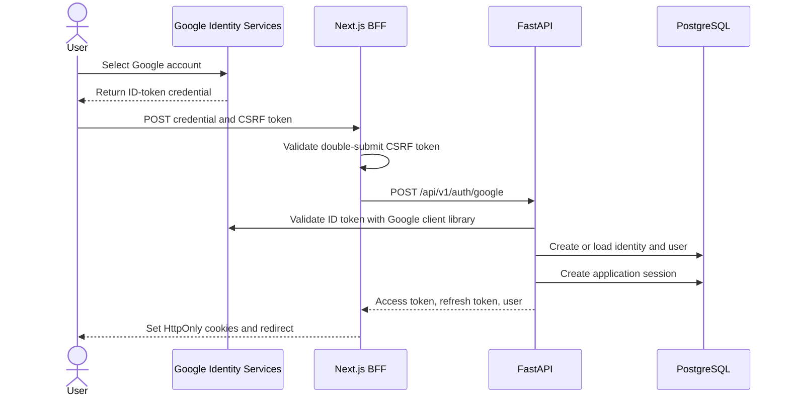

# EquityLens Phase 1: Google Authentication Design

- Status: Approved for implementation planning
- Date: 2026-07-13
- Parent design: `2026-07-13-us-equity-research-platform-design.md`
- Scope: Google-only sign-in, application sessions, protected pages, and locale preferences

This document replaces the parent design's email/password authentication requirements for Phase 1. Later phases may add email/password authentication, account linking, additional identity providers, and account recovery.

## 1. Goal

Deliver a secure, deployable user foundation for the EquityLens web application. A user signs in with Google, receives an EquityLens application session, visits protected pages, changes the interface language, and signs out.

The implementation supports both deployment profiles:

- Vercel: Next.js and FastAPI projects connected through server-to-server BFF calls
- Docker: Next.js and FastAPI services connected through the Compose network

## 2. Selected Architecture

Google Identity Services provides the sign-in user experience. Next.js acts as the same-origin Backend for Frontend (BFF), while FastAPI remains authoritative for users, external identities, and application sessions.



The BFF owns browser cookies and forwards authenticated requests to FastAPI. Browser code sends same-origin requests to Next.js routes. FastAPI validates Google credentials and issues EquityLens tokens independently from the Google session.

## 3. Authentication Flow

### 3.1 Start sign-in

1. `/{lang}/login` renders the official Sign in with Google button.
2. The Google button locale follows the active application locale.
3. The BFF issues a short-lived double-submit CSRF token for the login page.
4. The application stores a validated same-origin return path and active locale in short-lived state cookies.
5. Google returns the credential to the browser callback, which posts it and the CSRF token to `/api/auth/google/callback`.

### 3.2 Complete sign-in

1. The BFF validates the request origin and compares the CSRF cookie and request value using a constant-time comparison.
2. The BFF sends the Google credential to FastAPI over the configured server-to-server URL.
3. FastAPI uses the official Google Python client library to validate signature, audience, issuer, and expiry.
4. FastAPI requires the `email`, `email_verified`, and `sub` claims.
5. FastAPI uses `(provider, provider_subject)` as the stable identity key.
6. FastAPI creates a regular user during the first successful sign-in.
7. FastAPI creates an application session and returns a short-lived access token plus an opaque refresh token.
8. The BFF writes both tokens to HttpOnly cookies and redirects to the validated return path or `/{lang}/dashboard`.

Google credentials remain request-scoped. Logs and persistent storage exclude the credential.

Repeat sign-in updates `provider_email`, display name, avatar, and `last_login_at`. It preserves the original `User.email` and user-selected locale. A later account-management flow may promote a changed provider email to the primary account email.

### 3.3 Existing account collision

An email match without an existing Google external identity returns `AUTH_ACCOUNT_LINK_REQUIRED`. A future account-linking flow or an explicit migration command resolves the collision. This rule protects legacy users and the seeded administrator account from automatic identity attachment.

## 4. Domain Model

### 4.1 User changes

The existing `User` table gains:

| Field | Type | Purpose |
|---|---|---|
| `avatar_url` | nullable string | Google profile image |
| `preferred_locale` | enum/string | `en-US` or `zh-CN` |
| `created_at` | timezone-aware datetime | Audit timestamp |
| `updated_at` | timezone-aware datetime | Audit timestamp |

`hashed_password` becomes nullable so federated users have no local password credential.

### 4.2 ExternalIdentity

| Field | Type | Purpose |
|---|---|---|
| `id` | UUID | Internal identity ID |
| `user_id` | integer FK | Owning user |
| `provider` | string | `google` |
| `provider_subject` | string | Google `sub` claim |
| `provider_email` | string | Last observed Google email |
| `created_at` | datetime | First sign-in time |
| `last_login_at` | datetime | Latest successful sign-in |

Constraints:

- Unique `(provider, provider_subject)`
- One Google identity per user for Phase 1
- Indexed `user_id`

### 4.3 AuthSession

| Field | Type | Purpose |
|---|---|---|
| `id` | UUID | Session identifier |
| `user_id` | integer FK | Session owner |
| `token_hash` | fixed string | SHA-256 refresh-token digest |
| `token_family_id` | UUID | Rotation family |
| `expires_at` | datetime | Absolute expiry |
| `created_at` | datetime | Creation time |
| `rotated_at` | nullable datetime | Rotation time |
| `revoked_at` | nullable datetime | Revocation time |
| `replaced_by_id` | nullable UUID FK | Successor token record |

Each row represents one refresh-token version. Rotation creates a successor row in the same family, marks the current row as rotated, and links `replaced_by_id` inside one database transaction.

The raw refresh token uses cryptographically secure random bytes and appears only in the BFF cookie and refresh request. Reuse inside a ten-second concurrency grace window returns `AUTH_REFRESH_STALE` and keeps the family active. Reuse after the grace window revokes the token family. A stale response leaves browser cookies unchanged so the client can retry with the token written by the successful concurrent refresh.

A new Alembic migration applies these schema changes. Existing migrations remain immutable.

## 5. Token and Cookie Policy

### 5.1 Access token

- JWT signed with the configured application secret
- Lifetime: 15 minutes
- Claims: `sub`, `sid`, `type=access`, `iat`, and `exp`
- `sub` contains the internal EquityLens integer user ID serialized as a string
- `sid` contains the stable token-family UUID for the application session

### 5.2 Refresh token

- Opaque cryptographically secure token
- Lifetime: 30 days
- Stored as a SHA-256 digest in PostgreSQL
- Rotated after every successful refresh
- Revoked during logout, account disablement, expiry, or replay detection

### 5.3 Browser cookies

| Property | Development | Production |
|---|---|---|
| `HttpOnly` | enabled | enabled |
| `Secure` | configurable for localhost | enabled |
| `SameSite` | `Lax` | `Lax` |
| `Path` | `/` | `/` |
| `Domain` | omitted | omitted |

The BFF clears both cookies after logout and terminal session errors. Cookie contents stay unavailable to React client code.

## 6. API Contracts

All FastAPI endpoints use the `/api/v1` prefix.

### 6.1 FastAPI

```text
POST  /auth/google
POST  /auth/refresh
POST  /auth/logout
GET   /auth/me
PATCH /auth/me/preferences
```

`POST /auth/google` accepts a Google ID token and returns application tokens plus the current user. `POST /auth/refresh` accepts the current opaque refresh token and returns a rotated token pair. `POST /auth/logout` revokes the current session.

The legacy password token route leaves the mounted API surface during Phase 1.

### 6.2 Next.js BFF

```text
GET  /api/auth/csrf
POST /api/auth/google/callback
POST /api/auth/refresh
POST /api/auth/logout
GET  /api/auth/me
```

The BFF translates FastAPI authentication responses into cookie operations and localized redirects. A shared server-only API client attaches the access token to protected FastAPI requests. Route Handlers and Server Actions may perform one refresh-and-retry cycle because those execution contexts can update response cookies.

## 7. Frontend Experience

Phase 1 adds:

```text
/{lang}/login
/{lang}/dashboard
/{lang}/settings
```

### 7.1 Login page

- Uses the existing paper, ink, and orange design language
- Presents one primary Google sign-in action
- Displays localized privacy and session copy
- Preserves a validated same-origin return path
- Shows localized errors from stable backend codes

### 7.2 Protected application shell

- Covers dashboard and settings routes
- Uses a session gate backed by the same-origin `/api/auth/me` Route Handler
- Redirects unauthenticated requests to `/{lang}/login`
- Preserves the requested internal path
- Displays the user name, avatar, locale control, and sign-out action

The `/api/auth/me` Route Handler refreshes an expired access token once, writes rotated cookies, and returns the authenticated user. FastAPI remains the authorization boundary for every private resource.

### 7.3 Locale preference

- Google button text follows `en-US` or `zh-CN`
- Browser-language detection continues to control the first visit
- A manual language selection updates the locale cookie and authenticated user preference
- The stored user preference becomes the default after later sign-ins

The dashboard contains a Phase 1 authenticated shell and onboarding state. Company research content arrives in Phase 2.

## 8. Error Handling

FastAPI returns stable codes with a request ID:

| Code | Meaning | BFF behavior |
|---|---|---|
| `AUTH_INVALID_GOOGLE_TOKEN` | Credential validation failed | Return to localized login page |
| `AUTH_ACCOUNT_DISABLED` | User access is disabled | Clear cookies and show support copy |
| `AUTH_ACCOUNT_LINK_REQUIRED` | Email collides with a legacy account | Show account-linking guidance |
| `AUTH_SESSION_EXPIRED` | Refresh session expired | Clear cookies and require sign-in |
| `AUTH_REFRESH_STALE` | A concurrent request already rotated the token | Keep cookies and retry once |
| `AUTH_SESSION_REUSED` | Rotated refresh token was replayed | Revoke family and require sign-in |
| `AUTH_REQUIRED` | Protected resource lacks a valid access token | Refresh once or redirect to login |
| `VALIDATION_ERROR` | Request validation failed | Show localized generic error |

Authentication logs include request ID, internal user ID, session ID, and outcome. Token values, cookies, and Google credentials stay excluded.

## 9. Security Controls

- Official Google Identity Services browser library
- Official Google Python client library for ID-token verification
- Audience validation against `GOOGLE_CLIENT_ID`
- Double-submit CSRF validation on the Google callback
- Origin validation on refresh, logout, and preference mutations
- Same-origin allowlist for return paths
- Generic public authentication errors
- Database transaction and row lock for refresh rotation
- Configured production CORS origins
- Rate-limit integration point around Google login and refresh routes
- Constant-time comparison for security-sensitive token values

Phase 6 supplies distributed rate-limit storage through the selected cache provider. Phase 1 keeps the limiter interface and endpoint policy explicit.

## 10. Configuration

Required runtime settings:

```dotenv
GOOGLE_CLIENT_ID=
NEXT_PUBLIC_GOOGLE_CLIENT_ID=
SECRET_KEY=
BACKEND_URL=
FRONTEND_URL=
ACCESS_TOKEN_EXPIRE_MINUTES=15
REFRESH_TOKEN_EXPIRE_DAYS=30
REFRESH_REUSE_GRACE_SECONDS=10
COOKIE_SECURE=true
```

Google Cloud configuration registers the local, Vercel Preview, Vercel Production, and Docker web origins used by each environment.

## 11. Testing Strategy

### 11.1 Backend unit tests

- Valid, invalid, expired, wrong-audience, and unverified Google credentials
- First sign-in user and identity creation
- Repeat sign-in identity reuse and last-login update
- Existing email collision
- Disabled user rejection
- Access-token claims and expiry
- Refresh rotation, expiry, revocation, and replay
- Concurrent refresh grace handling
- Logout revocation
- Locale preference validation and persistence

Google verification uses an injected verifier interface with deterministic fixtures.

### 11.2 Backend integration tests

- Alembic upgrade against PostgreSQL
- Unique identity constraints
- Atomic refresh rotation
- Protected endpoint authorization
- Stable error response shape

### 11.3 Frontend unit and route tests

- English and Chinese login copy
- Google button locale
- Callback CSRF handling
- Cookie flags and expiry
- Protected-layout redirects
- Refresh-and-retry behavior
- Logout cookie clearing
- Settings locale persistence

### 11.4 End-to-end tests

Playwright uses a test-only injected Google verifier and deterministic credential fixture. The scenario covers first sign-in, dashboard access, locale switching, refresh, logout, and protected-route redirection.

## 12. Acceptance Criteria

1. A new user can sign in with Google and receives an EquityLens user record.
2. A returning Google identity reuses the same EquityLens user.
3. Dashboard and settings require a valid application session.
4. Access-token expiry triggers one successful refresh and request retry.
5. Refresh tokens rotate, and replay revokes the token family.
6. Logout revokes the active session and clears browser cookies.
7. English and Chinese login, dashboard shell, settings, and errors render correctly.
8. A manual locale choice persists across sign-in and refresh.
9. Authentication secrets and credentials stay absent from logs and client-readable storage.
10. Targeted backend, frontend, integration, and end-to-end authentication tests pass.
11. The authentication flow runs under both Vercel and Docker configuration profiles.

## 13. Delivery Boundary

Phase 1 delivers Google-only authentication, secure application sessions, protected pages, user preferences, and bilingual authentication UI.

Later delivery includes email/password authentication, email verification, password recovery, account linking UI, additional identity providers, organization restrictions, session-device management, and distributed rate-limit storage.
