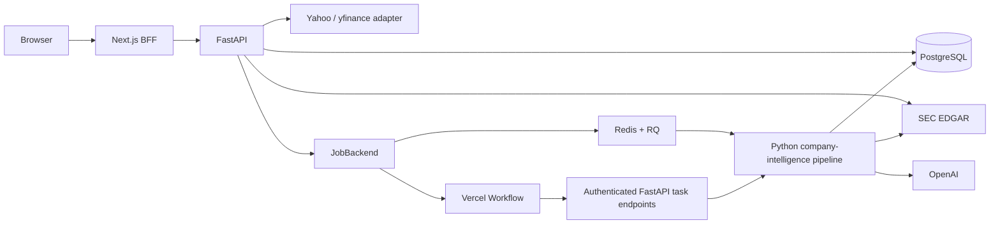

# EquityLens Phase 2: Company Intelligence Design

- Status: Approved for specification review
- Date: 2026-07-13
- Parent design: `2026-07-13-us-equity-research-platform-design.md`
- Depends on: Phase 0 engineering baseline and Phase 1 Google authentication
- Target user: Individual investors researching US-listed companies

## 1. Goal

Phase 2 turns the authenticated application shell into a useful company-research
product. A visitor can search for a US-listed company, inspect a compact market
and valuation summary, and understand the company's core businesses and place in
its value chain. A durable Agent retrieves the latest 10-K, extracts evidence,
and produces bilingual, citation-backed company intelligence.

The page must answer these questions in order:

1. What are the company's core products and revenue engines?
2. Which upstream inputs, technologies, and supplier categories does it depend on?
3. Which layer of the industry value chain does it control?
4. Who are its downstream customers and end markets?
5. Which companies compete with it?
6. What are its current price, market capitalization, EPS, and P/E ratios?
7. How have revenue, net income, and free cash flow changed across four fiscal
   years and the trailing-twelve-month period?

## 2. Scope

### 2.1 Included

- Public company search by ticker or company name
- Public company research pages for US-listed equities
- Compact quote and valuation cards sourced through a replaceable Yahoo Finance
  development adapter
- Four complete fiscal years plus TTM revenue, net income, and free cash flow
  sourced from SEC XBRL Company Facts
- Core-business and value-chain analysis grounded in the latest 10-K
- A left-to-right evidence flow: upstream → company layer → downstream
- Competitor and revenue-engine summaries with filing citations
- Durable background execution through Vercel Workflow or Docker RQ
- Observable job progress, stable failures, retries, and deduplication
- Guest Agent access with two accepted analyses per UTC day
- Authenticated Agent access with ten accepted analyses per UTC day
- Signed guest cookies and privacy-preserving daily IP abuse controls
- Authenticated user watchlists
- English and Simplified Chinese presentation content
- Unit, API, contract, frontend, and end-to-end tests

### 2.2 Excluded

- Historical stock-price charts
- Peer-multiple comparison
- Historical valuation bands
- Manual filing upload
- 10-Q narrative analysis
- Multi-turn RAG chat
- Personalized trade instructions
- Broker integration

The excluded document, valuation, and conversation capabilities remain in later
delivery phases.

## 3. Product Decisions

### 3.1 Research-first page

The selected UI is an evidence-led research story. Price and P/E remain compact
context at the top of the page. Core business, revenue engines, and the value
chain occupy the primary page area.

### 3.2 Data sources

- Yahoo Finance through `yfinance`: development source for quotes, profile data,
  market capitalization, EPS, trailing P/E, and forward P/E when available
- SEC submissions: CIK identity, filing metadata, accession numbers, form types,
  and original filing URLs
- SEC XBRL Company Facts: revenue, net income, operating cash flow, and capital
  expenditure facts
- Latest 10-K HTML: primary source for core-business and value-chain claims
- OpenAI: structured extraction, bilingual presentation, and claim-to-evidence
  verification

`yfinance` is an unofficial client intended for research and educational use.
The adapter is suitable for local development and product validation. Public
launch requires a market-data rights review and, when required, selection of a
licensed provider behind the same `MarketDataProvider` contract.

### 3.3 On-demand retrieval with persistence

Company data is loaded on demand and persisted in PostgreSQL. Each resource has
its own freshness rule:

| Resource | Freshness window |
|---|---:|
| Market quote and valuation | 15 minutes |
| Company profile | 7 days |
| SEC submissions metadata | 1 hour |
| SEC XBRL financial metrics | 24 hours |
| Company intelligence | Until accession number, schema, prompt, or model version changes |

A provider failure returns the latest valid snapshot with `freshness=stale`.
An initial provider failure returns a stable error code and preserves successful
sections of the company page.

## 4. User Journeys

### 4.1 Guest research

```text
Open localized dashboard
→ search by ticker or company name
→ open the public company page
→ view cached market and intelligence data
→ trigger a new analysis when no reusable snapshot exists
→ receive a signed guest identity cookie
→ watch the durable job progress
→ inspect cited business and value-chain conclusions
```

Viewing a reusable public snapshot consumes no Agent allowance. Successfully
accepting a new analysis job consumes one allowance.

### 4.2 Authenticated research

An authenticated user follows the same flow, receives ten analyses per UTC day,
and can add or remove the company from a private watchlist.

### 4.3 Repeated synchronization

```text
Request analysis
→ resolve latest 10-K accession number
→ find snapshot or active job with the same deduplication key
→ return the reusable snapshot or active job without consuming quota
→ otherwise reserve quota and create one durable job
```

## 5. Architecture



### 5.1 Frontend boundaries

- `dashboard`: public search, guest quota, and authenticated watchlist
- `company`: company header, market context, financial summary, intelligence,
  citations, and job state
- `guest`: signed identity cookie and quota responses
- `auth`: existing Google session BFF and optional authenticated principal
- `jobs`: polling and retry UI

The browser makes same-origin requests to Next.js Route Handlers. The BFF adds
the application access token when present and forwards the signed guest identity
when the visitor is signed out.

### 5.2 Backend boundaries

- `companies`: symbol normalization, search, CIK resolution, company persistence,
  and company-page orchestration
- `market_data`: provider contracts, Yahoo mapping, quote caching, valuation
  normalization, and freshness calculation
- `financials`: SEC Company Facts mapping and financial-period selection
- `filings`: SEC submissions, latest-10-K selection, HTML retrieval, section
  extraction, and filing persistence
- `research`: structured company-intelligence generation, localization, citation
  validation, and snapshot persistence
- `jobs`: durable job records, state transitions, deduplication, dispatch, and retry
- `quota`: guest identity, UTC-day allowance reservation, and IP abuse guardrails
- `watchlist`: authenticated user-to-company relationships

Each module exposes domain services. API routes and job adapters depend on those
services rather than provider implementations.

### 5.3 Provider contracts

The existing provider package gains these interfaces:

```python
class MarketDataProvider(Protocol):
    async def search_symbols(self, query: str) -> list[SymbolMatch]: ...
    async def get_quote(self, symbol: str) -> QuoteSnapshot: ...
    async def get_company_profile(self, symbol: str) -> CompanyProfile: ...


class SecDataProvider(Protocol):
    async def get_submissions(self, cik: str) -> CompanySubmissions: ...
    async def get_company_facts(self, cik: str) -> CompanyFacts: ...
    async def download_filing(self, filing: FilingReference) -> FilingContent: ...


class IntelligenceGenerator(Protocol):
    async def generate(self, evidence: EvidenceBundle) -> IntelligenceDraft: ...
    async def verify(self, draft: IntelligenceDraft) -> VerificationResult: ...
    async def localize(
        self, verified: VerifiedIntelligence, locale: str
    ) -> LocalizedIntelligence: ...
```

Provider factories select concrete adapters from validated configuration. Domain
services contain no direct deployment-target branches.

## 6. Data Model

### 6.1 `Company`

| Field | Purpose |
|---|---|
| `id` | Internal integer primary key |
| `symbol` | Uppercase canonical US ticker, unique |
| `cik` | Zero-padded ten-digit SEC CIK, unique |
| `name` | SEC/Yahoo display name |
| `exchange` | Primary exchange when available |
| `sector` | Provider sector when available |
| `industry` | Provider industry when available |
| `description` | Provider company description when available |
| `profile_fetched_at` | Profile freshness timestamp |

### 6.2 `Watchlist`

`Watchlist` stores `user_id`, `company_id`, and `created_at`. A unique constraint
on `(user_id, company_id)` makes add/remove operations idempotent.

### 6.3 `MarketSnapshot`

`MarketSnapshot` stores `company_id`, `price`, `previous_close`, absolute and
percentage change, `currency`, `market_cap`, `trailing_eps`, `trailing_pe`,
`forward_pe`, `provider`, `observed_at`, and `fetched_at`. Financial values use
`Decimal`. Missing provider fields remain null and carry a field-level reason.

### 6.4 `FinancialMetric`

Each row stores `company_id`, metric key, fiscal year, fiscal period, start and
end dates, value, unit, SEC taxonomy tag, accession number, filed date, and
source URL. The Phase 2 metric keys are:

- `revenue`
- `net_income`
- `operating_cash_flow`
- `capital_expenditure`
- `free_cash_flow`

`free_cash_flow = operating_cash_flow - capital_expenditure`, with expenditure
normalized to a positive cash outflow before subtraction. The API returns four
complete fiscal years and a TTM value assembled from the latest four reported
quarters when the required facts exist.

### 6.5 `Filing`

`Filing` stores `company_id`, accession number, form type, fiscal period, filing
date, report date, primary-document name, SEC source URL, content hash, and
retrieval timestamp. `(company_id, accession_number)` is unique.

### 6.6 `CompanyIntelligenceSnapshot`

The snapshot stores:

- `company_id` and `filing_id`
- `status` and evidence-coverage state
- `schema_version`, `prompt_version`, and model identity
- English and Simplified Chinese JSON payloads
- generation and verification timestamps
- overall confidence

Each localized payload contains:

```json
{
  "core_businesses": [],
  "revenue_engines": [],
  "upstream": [],
  "company_layer": [],
  "downstream": [],
  "competitors": [],
  "material_dependencies": []
}
```

Every item contains a concise title, explanation, confidence, and one or more
`citation_ids`. A revenue share appears only when a cited filing passage supports
the number and period.

### 6.7 `EvidenceCitation`

A citation stores `snapshot_id`, `filing_id`, section label, source anchor,
bounded excerpt, source URL, and verification verdict. Excerpts are limited to
1,000 characters. Public API responses expose the excerpt and SEC URL; logs
exclude filing excerpts.

### 6.8 `IngestionJob`

The job stores job type, company, requesting principal, deduplication key,
state, current step, provider run ID, attempt count, retry eligibility, stable
error code, timestamps, and resulting snapshot ID.

The unique active deduplication key is:

```text
company_id + accession_number + schema_version + prompt_version + model_id
```

### 6.9 `AgentDailyUsage`

The usage row stores principal type, keyed principal hash, UTC date, accepted
count, limit, and timestamps. Database constraints prevent negative values and
counts above the reserved limit.

## 7. Agent Pipeline

The durable state sequence is:

```text
queued
→ downloading
→ parsing
→ analyzing
→ verifying
→ localizing
→ completed
```

The existing shared `JobState` adds `verifying` and `localizing`. Any step may
enter `failed` with a stable error code and retry metadata.

### 7.1 Downloading

1. Resolve the company CIK.
2. Fetch SEC submissions with an identifiable `User-Agent`.
3. Select the latest filed 10-K.
4. Persist its accession metadata.
5. Download the primary HTML document from SEC Archives.
6. Record the content hash and source URL.

### 7.2 Parsing

The parser extracts the filing headings and bounded content needed for Phase 2:

- Item 1, Business
- Item 1A, Risk Factors
- relevant revenue-disaggregation and segment notes
- customer, supplier, competition, and concentration passages

The parser preserves source anchors and section labels so each extracted passage
can become a citation.

### 7.3 Analyzing

The generator receives a bounded evidence bundle and returns schema-validated
JSON. It may classify only claims grounded in supplied evidence. Unknown fields
remain empty and receive `insufficient_evidence` coverage.

### 7.4 Verifying

Verification has two layers:

1. Deterministic validation confirms schema, citation existence, filing
   consistency, source anchors, and field constraints.
2. A structured model verifier evaluates each claim against its cited excerpts.

Unsupported claims are removed. The job can complete with partial coverage when
the remaining verified claims still form a useful snapshot.

### 7.5 Localizing

The verified English fact set is rendered into `en-US` and `zh-CN`. Citation IDs,
numbers, company names, fiscal periods, and confidence values remain invariant
across locales. The localized output passes the same schema before persistence.

## 8. Job Backends

### 8.1 Vercel profile

The stable TypeScript Workflow SDK runs in the Next.js project. A workflow uses
durable steps to invoke authenticated, idempotent FastAPI task endpoints. FastAPI
owns all domain state and writes progress after each step. The workflow stores
identifiers and compact step results; filing bodies remain in the backend data
plane.

Internal task requests use a dedicated signed bearer credential, job ID,
deduplication key, and step idempotency key. Each task endpoint verifies the
credential and expected current job state.

### 8.2 Docker profile

The RQ adapter enqueues the same company-intelligence pipeline in Redis. A Python
worker executes domain steps, writes the same PostgreSQL states, and uses bounded
retries with exponential intervals. RQ job IDs are stored as provider run IDs.

### 8.3 Shared behavior

Both profiles preserve identical API states, deduplication rules, retry limits,
stable error codes, and final database records. Contract tests run the common job
scenarios against both adapters with provider fixtures.

## 9. Guest Identity and Quotas

### 9.1 Guest identity

The BFF creates a cryptographically random guest ID and stores it in a signed,
HttpOnly, SameSite=Lax cookie. Production cookies use `Secure`. The backend sees
only a signed guest assertion created by the BFF.

The database stores a keyed hash of the guest ID. It never stores raw guest IDs
or raw IP addresses.

### 9.2 Allowances

| Principal | Accepted analyses per UTC day |
|---|---:|
| Guest | 2 |
| Authenticated user | 10 |
| Daily IP-hash abuse guardrail | 10 |

The IP guardrail uses `HMAC(secret, UTC-date + normalized-IP)` and rotates daily.
It limits repeated cookie resets while allowing several visitors on a shared
network.

### 9.3 Atomic reservation

Quota reservation uses one PostgreSQL transaction and an atomic upsert. The
transaction creates the durable job record and increments the applicable usage
rows. A queue-dispatch failure leaves a queued database job for dispatcher retry,
so the accepted request remains recoverable.

These cases preserve the allowance:

- returning a reusable snapshot
- returning an already-active deduplicated job
- reading market, financial, or intelligence data
- searching for companies

Quota responses contain:

```json
{
  "limit": 2,
  "used": 1,
  "remaining": 1,
  "resets_at": "2026-07-14T00:00:00Z"
}
```

## 10. API Design

Public and optionally authenticated endpoints:

```text
GET  /api/v1/companies/search?q=
GET  /api/v1/companies/{symbol}
GET  /api/v1/companies/{symbol}/market
GET  /api/v1/companies/{symbol}/financials
GET  /api/v1/companies/{symbol}/intelligence
POST /api/v1/companies/{symbol}/sync
GET  /api/v1/agent-quota
GET  /api/v1/jobs/{job_id}
POST /api/v1/jobs/{job_id}/retry
```

Authenticated endpoints:

```text
GET    /api/v1/watchlist
POST   /api/v1/watchlist/{symbol}
DELETE /api/v1/watchlist/{symbol}
```

`POST /companies/{symbol}/sync` returns one of:

- `200` with `reused_snapshot`
- `200` with `active_job`
- `202` with a newly accepted job and updated quota
- `429` with `AGENT_DAILY_QUOTA_EXCEEDED`

Job status is visible to the same guest or user who requested it. Completed
company-intelligence snapshots become shared public research resources for all
visitors.

## 11. Frontend Design

### 11.1 Public dashboard

- Search input accepts ticker and company name.
- Results show ticker, company name, and exchange.
- Guest quota appears near the search action.
- Authenticated users see their watchlist with compact quote and P/E context.

### 11.2 Company page

The selected reading order is:

```text
Company identity and watchlist action
→ compact price, market cap, EPS, trailing P/E, and forward P/E
→ core business and revenue engines
→ upstream → company layer → downstream evidence flow
→ competitors and material dependencies
→ four fiscal years + TTM financial summary
→ source, freshness, model, and generation metadata
```

Every intelligence card opens its filing citations. Desktop uses a horizontal
evidence flow. Mobile converts the same flow into a vertical sequence while
preserving upstream → company → downstream order.

### 11.3 Agent states

- No snapshot: explain the source and show `Analyze company`.
- Active job: show current durable step and poll the job endpoint.
- Completed: replace progress with the cited snapshot.
- Partial evidence: show verified sections and an evidence-coverage notice.
- Failed: show the stable localized reason and retry eligibility.
- Quota exhausted: show reset time and Google sign-in action for guests.

### 11.4 Internationalization

All UI and error copy uses the existing `en-US` and `zh-CN` dictionaries. The
company name, financial values, SEC excerpts, and filing metadata remain source
faithful. Explanations follow the active locale. `Intl` formats currency, compact
market capitalization, percentages, dates, and fiscal periods.

## 12. Security and Privacy

- Company research endpoints expose public-company information only.
- Watchlists remain authenticated and user-scoped.
- Job status is requester-scoped until the snapshot is complete.
- Internal workflow task endpoints require a dedicated signed service token.
- SEC HTML passes through size limits, content-type checks, and parser timeouts.
- Prompts treat filing text as untrusted data and separate it from instructions.
- Structured-output and citation verification gate persistence.
- Logs contain request IDs, job IDs, company IDs, step names, and stable errors.
- Logs exclude cookies, guest IDs, raw IPs, filing bodies, evidence excerpts,
  prompts containing filing text, and model credentials.
- Database quota updates are atomic.
- Search and sync endpoints receive separate request-rate limits in addition to
  daily Agent allowances.

## 13. Error Handling

| Scenario | Behavior |
|---|---|
| Yahoo timeout | Return the last valid market snapshot as `stale` |
| Yahoo field unavailable | Return null with a field-level missing reason |
| SEC 429 or 5xx | Retry with bounded exponential backoff |
| Filing missing expected sections | Complete with partial evidence coverage |
| Parser failure | Fail with `FILING_PARSE_FAILED` and retry eligibility |
| Model structured-output failure | Retry generation, then fail with `INTELLIGENCE_GENERATION_FAILED` |
| Unsupported citations | Remove unsupported claims; preserve verified claims |
| No supported claims | Fail with `INSUFFICIENT_EVIDENCE` |
| Duplicate synchronization | Return the active job or reusable snapshot |
| Daily allowance exhausted | Return `AGENT_DAILY_QUOTA_EXCEEDED` and reset time |
| Job-adapter dispatch failure | Keep the database job queued for dispatch retry |

## 14. Test Strategy

### 14.1 Backend unit tests

- symbol normalization and company search mapping
- Yahoo quote, profile, EPS, and P/E normalization
- Decimal handling and field-level missing reasons
- SEC submissions and latest-10-K selection
- SEC Company Facts tag fallback and four-year/TTM period selection
- free-cash-flow calculation
- filing-section extraction and source anchors
- intelligence schema validation
- citation existence and model-verification filtering
- bilingual payload invariants
- job transitions, deduplication, retry metadata, and idempotency
- guest cookie assertions, keyed hashes, UTC reset boundaries, and quotas
- concurrent quota reservation
- authenticated watchlist isolation

### 14.2 Provider and integration tests

- HTTP providers use recorded SEC and Yahoo fixtures.
- Tests never depend on live external responses.
- PostgreSQL tests cover unique constraints, atomic quota updates, job
  deduplication, and watchlist authorization.
- Shared job-backend contract tests run against Vercel Workflow and RQ adapters.
- Internal task endpoints verify service credentials and step idempotency.

### 14.3 Frontend tests

- public and authenticated dashboard variants
- company search keyboard and empty states
- market cards with fresh, stale, and missing values
- core-business and evidence-flow components
- citation drawer and SEC links
- job progress, partial evidence, failure, and retry states
- guest and user quota displays
- watchlist sign-in boundary
- English and Chinese dictionary parity and formatting

### 14.4 End-to-end tests

```text
Guest opens dashboard
→ searches AAPL
→ opens company page
→ starts an Agent analysis
→ sees durable progress
→ reads core business and value chain
→ opens a filing citation
→ starts one more company analysis
→ receives the daily quota state on the third new analysis
```

An authenticated scenario verifies ten-analysis quota semantics with fixture jobs
and private watchlist add/remove behavior. Deployment smoke tests run the same
public company flow against Vercel Preview and Docker Compose.

Core business modules maintain at least 80% statement and branch coverage.

## 15. Acceptance Criteria

1. A guest can search for a US-listed company and open its public company page.
2. The page displays price, market capitalization, EPS, trailing P/E, forward
   P/E when available, source, timestamp, and freshness.
3. The page displays four fiscal years plus TTM revenue, net income, and free
   cash flow when supported by SEC facts.
4. A guest can trigger two new company-intelligence jobs per UTC day.
5. An authenticated user can trigger ten new jobs per UTC day.
6. Reusable snapshots and active deduplicated jobs preserve quota.
7. The Agent retrieves the latest 10-K and persists its accession number and URL.
8. A completed snapshot identifies core businesses, revenue engines, upstream
   dependencies, company layer, downstream customers, and competitors.
9. Every displayed intelligence claim contains at least one verified filing
   citation.
10. English and Chinese payloads preserve the same facts, numbers, citations,
    and confidence values.
11. The UI exposes queued, downloading, parsing, analyzing, verifying,
    localizing, completed, partial-evidence, and failed experiences.
12. Yahoo failures return the latest market snapshot with `stale` freshness.
13. SEC and model failures produce stable codes and retry metadata.
14. Watchlists remain isolated to the authenticated user.
15. Vercel Workflow and Docker RQ pass the shared job-backend contract tests.
16. Backend, frontend, Playwright, Vercel Preview, and Docker smoke gates pass.

## 16. Delivery Slices

1. Company, watchlist, market, financial, filing, intelligence, job, and quota
   schema migrations
2. Company search and public company API
3. Yahoo market adapter and cached valuation cards
4. SEC submissions and Company Facts adapters
5. Guest identity, authenticated principal resolution, and atomic quotas
6. Filing extraction, structured intelligence, citation verification, and
   bilingual localization
7. Durable job records and Docker RQ adapter
8. Vercel Workflow orchestration and internal task endpoints
9. Public dashboard and company evidence-flow page
10. Watchlist, Agent states, citations, quota UI, and E2E coverage
11. Deployment verification and market-data launch review

Each slice follows test-driven development and produces a focused English Git
commit.

## 17. External References

- [SEC EDGAR Application Programming Interfaces](https://www.sec.gov/search-filings/edgar-application-programming-interfaces)
- [SEC Developer Frequently Asked Questions](https://www.sec.gov/about/developer-resources)
- [yfinance documentation and legal disclaimer](https://ranaroussi.github.io/yfinance/)
- [yfinance Search and Lookup](https://ranaroussi.github.io/yfinance/reference/yfinance.search.html)
- [yfinance Ticker API](https://ranaroussi.github.io/yfinance/reference/api/yfinance.Ticker.html)
- [Vercel Workflows](https://vercel.com/workflows)
- [Vercel Workflow durable-execution model](https://vercel.com/blog/a-new-programming-model-for-durable-execution)
- [Vercel Queues public beta](https://vercel.com/changelog/vercel-queues-now-in-public-beta)
- [RQ Jobs](https://python-rq.org/docs/jobs/)
- [RQ Results and retries](https://python-rq.org/docs/results/)
