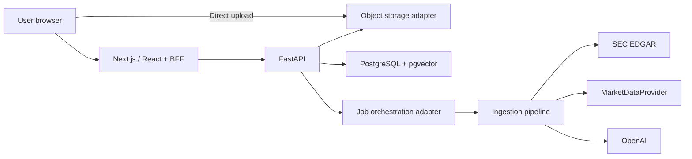

# EquityLens: Full-Stack Design

- Status: Approved for implementation planning
- Date: 2026-07-13
- Target release: Public-beta MVP
- Target user: Individual investors researching US-listed companies

## 1. Product Goal

Transform the existing FastAPI, LangChain, and PostgreSQL/pgvector backend prototype into EquityLens, a complete US equity research platform. Registered users can search for companies, inspect prices and valuations, understand each company's position in its value chain, upload filings, let a background agent retrieve SEC filings, and ask evidence-backed questions.

The company research page should answer five questions first:

1. What are the company's current share price and market valuation?
2. Which products and businesses generate its revenue?
3. Where does the company sit in its industry value chain?
4. What are the quality and direction of its financial results?
5. How does its current P/E compare with its history and peers?

## 2. MVP Scope and Assumptions

### 2.1 Operating assumptions

- The public beta serves approximately 100 users.
- The public beta is free.
- Delayed market data is acceptable when the UI displays its source and timestamp.
- The initial market is US equities, with 10-K and 10-Q filings as the primary documents.
- The frontend supports Simplified Chinese and English.
- SEC filings remain in English; AI summaries and answers follow the selected interface language.

### 2.2 MVP capabilities

- Registration, email verification, login, session refresh, and logout
- Symbol search and a personal watchlist
- A company research dashboard
- Share price, market capitalization, EPS, trailing P/E, and forward P/E when available
- Business, value-chain, financial-trend, and valuation summaries
- Manual PDF upload
- Automatic retrieval of SEC 10-K and 10-Q filings
- Document parsing, chunking, embedding, and visible processing status
- User- and company-scoped RAG conversations
- Answers with source citations
- Automatic language detection and manual language switching
- Unit, integration, and end-to-end tests

### 2.3 Later scope

- Tick-level real-time market data
- Broker integrations and automated trading
- Personalized buy or sell instructions
- Return guarantees
- Subscription billing
- Mainland China and Hong Kong equities
- Advanced DCF, options, and portfolio analysis

## 3. Selected Product Approach

The MVP uses a research-dashboard-first experience.

A chat-first experience reuses more of the current RAG prototype and expects users to formulate useful questions. A filing-reader-first experience provides strong source traceability and requires more navigation before an individual investor can understand the business and valuation. A research dashboard gives the target user a repeatable company-analysis framework, so it is the selected MVP approach.

## 4. System Architecture



The application has one platform-neutral core and two supported deployment profiles: Vercel and Docker. Infrastructure-specific behavior stays behind storage, queue, document-parser, email, and market-data interfaces.

### 4.1 Frontend

- React, Next.js App Router, and TypeScript
- A standalone `frontend/` application directory
- Clear boundaries between Server Components and Client Components
- Next.js Route Handlers as a Backend for Frontend (BFF)
- Same-origin `/api` requests from the browser to the BFF
- Same-origin HttpOnly session cookies managed by the BFF
- Direct large-file uploads through a deployment-selected upload transport
- Server-Sent Events for streamed AI responses
- English and Simplified Chinese dictionaries for all UI copy

Recommended structure:

```text
frontend/
├── app/[lang]/
├── components/
├── features/
├── lib/
├── hooks/
├── dictionaries/
├── types/
└── tests/
```

### 4.2 FastAPI

The existing `backend/` remains the business API and is divided into these modules:

- `auth`: registration, email verification, login, refresh, and logout
- `companies`: symbol search, company records, and watchlists
- `market_data`: quotes, financial metrics, and valuation metrics
- `documents`: upload intents, downloads, and document management
- `ingestion`: parsing, chunking, and embedding
- `research`: value-chain, financial, and valuation summaries
- `chat`: conversations, messages, retrieval, and citations
- `jobs`: background-job status

Email verification uses an `EmailSender` interface. The MVP adapter uses SMTP configured through environment variables.

### 4.3 Background jobs

The ingestion pipeline defines idempotent, retryable steps independently from the job backend:

```text
queued
→ downloading
→ parsing
→ embedding
→ analyzing
→ completed
```

A failed job enters `failed` and records the failed step, stable error code, attempt count, and retry eligibility.

The Vercel profile uses Vercel Workflow and Queues. A thin TypeScript orchestrator invokes authenticated FastAPI task endpoints and persists progress after every durable step. The Docker profile uses Redis and RQ with a separate Python worker process. Both adapters implement the same job submission, status, retry, and deduplication contracts.

### 4.4 Storage

- PostgreSQL + pgvector: users, companies, metrics, valuations, document metadata, vectors, jobs, and conversations
- `ObjectStorageProvider`: original SEC files and user-uploaded PDFs
- `CacheProvider`: short-lived market snapshots, rate counters, and distributed locks
- Vercel profile: Vercel Blob, Marketplace PostgreSQL with pgvector, and a managed Redis integration when caching requires it
- Docker profile: S3-compatible MinIO, PostgreSQL with pgvector, and Redis

### 4.5 Deployment profiles

The repository keeps application code shared and deployment configuration explicit:

```text
frontend/                 # Next.js application and Vercel orchestration adapter
backend/                  # FastAPI API, domain services, and Docker RQ worker entry point
deploy/vercel/            # Vercel project configuration and deployment checks
deploy/docker/            # Container entry points and production Compose overrides
docker-compose.yml        # Local and self-hosted stack
```

#### Vercel profile

- Two Vercel Projects from one Git repository: `frontend/` for Next.js and `backend/` for FastAPI
- Vercel Blob client uploads for PDFs, followed by an authenticated document-finalization call
- Vercel Workflow and Queues for SEC synchronization, parsing, embedding, and research generation
- Neon or Supabase PostgreSQL through Vercel Marketplace, with pgvector enabled
- A lightweight parser inside Vercel Functions and a managed document-parser adapter for OCR-heavy filings
- Vercel Cron for scheduled SEC synchronization

#### Docker profile

- Next.js, FastAPI, RQ worker, PostgreSQL/pgvector, Redis, and MinIO containers
- The same API routes, database schema, job states, and object keys as the Vercel profile
- A local document-parser adapter with optional OCR dependencies
- A scheduler container for periodic SEC synchronization

Deployment selection uses environment variables:

```dotenv
DEPLOYMENT_TARGET=vercel|docker
OBJECT_STORAGE_PROVIDER=vercel_blob|s3
JOB_BACKEND=vercel_workflow|rq
DOCUMENT_PARSER=managed|local
```

Provider factories validate each combination during startup. Domain modules receive provider interfaces through dependency injection and never branch directly on `DEPLOYMENT_TARGET`.

## 5. Data Sources and Responsibilities

### 5.1 SEC EDGAR

The server uses `data.sec.gov` for:

- Ticker-to-CIK mapping
- Company submission history
- 10-K and 10-Q filings
- XBRL Company Facts

Every SEC request runs on the server, includes an identifiable `User-Agent`, stays below the SEC's global rate threshold of ten requests per second, and deduplicates filings by accession number.

### 5.2 Market data and valuation

The backend defines a replaceable `MarketDataProvider` contract:

```text
search_symbols(query)
get_quote(symbol)
get_company_profile(symbol)
get_financial_metrics(symbol)
get_valuation_metrics(symbol)
```

The first MVP adapter uses Alpha Vantage. Deployment configuration selects the data entitlement. Every market-data card displays the provider, timestamp, and freshness state. Provider failures return the latest valid cached snapshot.

### 5.3 Structured values and AI interpretation

- The market-data provider supplies price and market capitalization.
- SEC XBRL and the financial-data provider supply revenue, earnings, EPS, and cash flow.
- Backend services use `Decimal` for financial calculations.
- The AI layer interprets value-chain position, financial changes, and valuation context.
- Every AI conclusion records citations, model identity, generation time, and source-version identifiers.

`Trailing P/E = current share price / trailing-twelve-month EPS`. When trailing EPS is zero or negative, the P/E status is `NM`. Forward P/E appears only when the provider supplies forward consensus EPS.

## 6. Frontend Pages

```text
/{lang}/register
/{lang}/login
/{lang}/dashboard
/{lang}/stocks/[symbol]
/{lang}/stocks/[symbol]/documents
/{lang}/settings
```

### 6.1 User dashboard

- Watchlist
- Recent company research
- Document-processing jobs
- Recent conversations
- Symbol search

### 6.2 Company research page

The page presents:

1. Company name, ticker, price, price change, market capitalization, and timestamp
2. Trailing P/E, forward P/E, EPS, and valuation status
3. Business model, revenue sources, and major costs
4. Upstream inputs, the company's value-chain layer, downstream customers, and competitors
5. Revenue, gross margin, net income, EPS, free cash flow, and debt trends
6. Current P/E, historical range, and peer comparison
7. 10-K, 10-Q, and user-uploaded documents
8. An AI research assistant with filing citations

### 6.3 Document center

- Manual PDF upload
- SEC synchronization action
- Source, form type, fiscal period, and processing state
- Stable failure reason and retry action
- Original-file and citation navigation

## 7. Domain Model

### 7.1 Core models

| Model | Responsibility |
|---|---|
| `User` | Account, email status, and language preference |
| `Company` | Ticker, CIK, name, exchange, and industry |
| `Watchlist` | User-to-company watchlist relationship |
| `Document` | SEC or uploaded document metadata and access scope |
| `DocumentChunk` | Text, vector, page, section, and retrieval metadata |
| `FinancialMetric` | Metric, period, value, unit, and source |
| `MarketSnapshot` | Price, market capitalization, P/E, and data timestamp |
| `IndustryPosition` | Value-chain layer, upstream, downstream, competitors, and evidence |
| `ResearchSnapshot` | Financial and valuation summary, source version, and visibility |
| `Conversation` | User, company, title, and creation time |
| `Message` | Role, content, locale, and citations |
| `IngestionJob` | Job state, step, error, and retry metadata |

### 7.2 Document and research access

- SEC documents are shared company resources for authenticated users.
- Uploaded documents store an `owner_id` and participate only in retrievals authorized for that owner.
- Public research snapshots use public SEC documents exclusively.
- A research snapshot that includes private documents stores the owner's `user_id`.
- Conversations and messages always store a `user_id`.
- Document chunks inherit `company_id`, `owner_id`, and `visibility` from their document.

Vector retrieval applies this filter:

```text
company_id = requested_company
AND (
  visibility = public
  OR owner_id = current_user
)
```

## 8. API Design

All endpoints use the `/api/v1` prefix.

### 8.1 Authentication

```text
POST  /auth/register
POST  /auth/verify-email
POST  /auth/login
POST  /auth/refresh
POST  /auth/logout
GET   /auth/me
PATCH /auth/me/preferences
```

### 8.2 Companies and market data

```text
GET    /companies/search?q=
GET    /companies/{symbol}
POST   /companies/{symbol}/sync
GET    /companies/{symbol}/market
GET    /companies/{symbol}/financials
GET    /companies/{symbol}/research
GET    /watchlist
POST   /watchlist/{symbol}
DELETE /watchlist/{symbol}
```

### 8.3 Documents and jobs

```text
POST /companies/{symbol}/documents/upload-intents
POST /companies/{symbol}/documents/upload-completions
GET  /companies/{symbol}/documents
GET  /documents/{document_id}
GET  /documents/{document_id}/download
POST /documents/{document_id}/retry
GET  /jobs/{job_id}
```

### 8.4 Chat

```text
POST /companies/{symbol}/conversations
GET  /companies/{symbol}/conversations
GET  /conversations/{conversation_id}
POST /conversations/{conversation_id}/messages
```

The message endpoint streams token, citation, completion, and error events over SSE.

## 9. Core Data Flows

### 9.1 Opening a company page

```text
Enter ticker
→ load Company and cached data
→ return available market and research data
→ evaluate freshness
→ enqueue an update when required
→ show job state
→ refresh cards after completion
```

### 9.2 Automatic filing retrieval

```text
ticker → CIK
→ submissions
→ select 10-K and 10-Q filings
→ deduplicate accession numbers
→ download original filing
→ store original object
→ parse and chunk
→ generate embeddings
→ extract value-chain evidence
→ generate research snapshot
```

### 9.3 User upload

```text
authenticate and authorize
→ validate declared size and type
→ issue UUID object key and short-lived signed URL
→ browser uploads directly to Google Cloud Storage
→ frontend confirms completion with FastAPI
→ worker validates the stored object and moves it into quarantine processing
→ create IngestionJob
→ parse, embed, and summarize
→ bind owner_id and company_id
```

### 9.4 RAG question answering

```text
authorize user_id and company_id
→ retrieve public SEC chunks and the current user's private chunks
→ assemble grounded context
→ answer in the selected locale
→ emit citations
→ persist Conversation and Message
```

Each citation contains document name, form type, fiscal period, section or page, original SEC URL, and retrieved excerpt.

## 10. Internationalization

### 10.1 Supported locales

```text
zh-CN
en-US
```

Locale selection follows this precedence:

```text
Current URL
→ authenticated user's preferred_locale
→ locale cookie
→ browser Accept-Language
→ en-US
```

On a first visit to `/`, Next.js Proxy reads `Accept-Language` and redirects to `/{lang}`. The language selector preserves the current path and ticker, updates the locale cookie, and synchronizes `preferred_locale` for authenticated users.

### 10.2 Translation boundaries

- Dictionaries provide all page, button, status, and error copy.
- Backend responses expose stable error codes; the frontend translates them.
- `Intl` formats dates and numbers for the active locale.
- US equity currency values use USD.
- SEC source text remains in English.
- AI summaries and answers follow the active locale.
- Citations show the English excerpt with an explanation in the active locale.

## 11. Security Design

### 11.1 Authentication and sessions

- Passwords use a strong adaptive password hash.
- Access tokens are short-lived, and refresh tokens rotate.
- The Next.js BFF stores the session in a same-origin HttpOnly, Secure cookie.
- FastAPI accepts authenticated BFF requests and authorized internal bearer tokens.
- Registration and login endpoints use rate limits.
- Registration includes email verification.
- Production CORS allows only configured frontend origins.

### 11.2 Upload security

Named configuration constants define the upload boundary:

```text
MAX_UPLOAD_SIZE_MB = 25
MAX_PDF_PAGES = 500
ALLOWED_FILE_TYPES = application/pdf
```

The backend validates extension, MIME type, file signature, size, and page count. Stored objects use UUID names outside the web root. Uploads move through `quarantined`, `processing`, `ready`, or `failed` states.

### 11.3 Data protection

- Every private-resource read enforces owner authorization.
- Logs contain request IDs, job IDs, and internal user IDs.
- Logs exclude API keys, cookies, complete filing contents, and complete AI contexts.
- Database access uses an ORM or parameterized queries.

## 12. Error Handling and Recovery

| Scenario | Behavior |
|---|---|
| Market-data timeout | Return cached data and its freshness state |
| SEC 429 or 5xx | Retry with exponential backoff |
| PDF parsing failure | Preserve the original, record the failed step, and allow retry |
| OpenAI failure | Persist the user question and allow regeneration |
| Partial financial data | Render available metrics and label missing fields |
| Worker interruption | Resume from the last completed step |
| Duplicate synchronization | Deduplicate with company and accession locks |
| Insufficient citation evidence | Return an insufficient-evidence state |

Stable error response example:

```json
{
  "code": "DOCUMENT_PARSE_FAILED",
  "request_id": "req_123"
}
```

## 13. Financial Information Boundary

The product organizes information and supports research. Every page shows data sources, timestamps, valuation formulas, and risk notices. Automated execution, return guarantees, and personalized trade instructions require a later compliance review. Market-data licensing and legal review are launch gates for a paid release.

## 14. Test Strategy

### 14.1 Backend unit tests

Use `pytest` to cover:

- Registration, login, tokens, and authorization
- P/E and valuation formulas
- SEC response mapping
- Upload validation
- User-data isolation
- Vector-retrieval filters
- Agent state transitions, retries, and deduplication
- Stable API error codes

### 14.2 Frontend unit tests

Use Vitest and React Testing Library to cover:

- Price and P/E cards
- Registration and login forms
- Upload controls
- Job-status components
- Citation components
- Locale resolution and language switching
- Translation dictionary key parity
- English and Chinese number, currency, and date formatting

Core business modules target at least 80% statement and branch coverage.

### 14.3 Integration tests

- PostgreSQL and pgvector retrieval
- Shared job-backend contract against Vercel Workflow/Queues and Redis/RQ adapters
- Shared object-storage contract against Vercel Blob and S3-compatible adapters
- SEC and market-provider fixtures
- Cross-user authorization boundaries
- SSE event ordering
- Document-parser contract against managed and local adapters

### 14.4 End-to-end tests

Use Playwright to cover:

- Registration, verification, login, and logout
- Symbol search and company-page navigation
- Automatic SEC retrieval
- PDF upload and visible progress
- Question answering and citation navigation
- Cached-data and provider-error states
- Automatic Chinese and English locale detection
- Manual language selection and persistence

### 14.5 Deployment verification

- `vercel build` succeeds for the Next.js and FastAPI projects.
- A Vercel Preview deployment passes registration, upload, background-job, retrieval, and citation smoke tests.
- `docker compose build` succeeds for every application image.
- `docker compose up --wait` reaches healthy status and the same smoke tests pass against the Docker profile.
- Database migrations run from a dedicated release command in both profiles.
- Configuration validation fails early when a required provider credential or adapter setting is missing.

### 14.6 RAG evaluation

Maintain at least 20 fixed questions covering revenue sources, value-chain position, gross-margin changes, P/E, and management risks. Each result checks the company, fiscal period, numerical consistency, citation support, and response locale. Missing source support produces an explicit insufficient-evidence result.

## 15. MVP Acceptance Criteria

1. A user can register, verify an email address, log in, and log out.
2. A user can search for a US equity symbol and open its company page.
3. The company page shows price, market capitalization, P/E, EPS, source, and timestamp.
4. A user can upload a PDF filing.
5. The agent can retrieve the company's 10-K and 10-Q filings.
6. The UI shows background-job progress and failure states.
7. The system generates cited value-chain, financial, and valuation summaries.
8. A user can hold a multi-turn conversation grounded in company documents.
9. Private documents and conversations remain isolated between users.
10. Provider failures produce cached data with a freshness label.
11. A Chinese browser enters the Chinese site on first visit, and an English browser enters the English site.
12. A manual language choice persists across refresh and subsequent login.
13. AI responses follow the active page locale.
14. Core business unit tests reach the 80% coverage target.
15. Critical end-to-end scenarios and RAG evaluations pass.
16. The Vercel Preview deployment passes the defined deployment smoke tests.
17. The Docker Compose deployment reaches healthy status and passes the same deployment smoke tests.

## 16. Delivery Phases

| Phase | Deliverable |
|---|---|
| 0. Engineering baseline | Align Python, add Alembic and test frameworks, define provider contracts, and create Vercel and Docker environment profiles |
| 1. Users and i18n | Registration, login, secure cookies, protected pages, and localized routes |
| 2. Company dashboard | Search, quote, P/E, company profile, and watchlist |
| 3. Document center | PDF upload, storage and queue adapters, and job-status UI |
| 4. SEC agent | 10-K/10-Q retrieval, parsing, XBRL, and deduplication |
| 5. RAG research | Multi-tenant retrieval, value-chain summaries, citations, and streamed chat |
| 6. Product hardening | Caching, rate limits, logging, E2E tests, RAG evaluation, Vercel Preview deployment, and Docker deployment |

Each phase delivers a runnable increment. Its tests and acceptance checks form the gate for the next phase.

## 17. Migration from the Existing Codebase

### 17.1 Reuse

- FastAPI application entry point and API version prefix
- SQLModel user model and JWT foundation
- PostgreSQL and pgvector technology choice
- Core PDF-ingestion workflow
- LangChain history-aware retrieval concept

### 17.2 Targeted changes

- Add Alembic for schema migrations.
- Replace global `chat_history` with `Conversation` and `Message` tables.
- Replace the single `docs` collection with an application-owned `DocumentChunk` table carrying company, document, user, and access metadata.
- Replace synchronous `.invoke()` inside async routes with an observable streaming chat service.
- Move command-line ingestion into a platform-neutral pipeline triggered by Vercel Workflow/Queues or Redis/RQ.
- Add object-storage, job-backend, cache, and document-parser interfaces with contract tests.
- Add Vercel Blob and S3-compatible storage adapters.
- Add Vercel and Docker deployment profiles with shared health and smoke tests.
- Replace collection-wide deletion with idempotent updates scoped by document ID.
- Replace wildcard CORS with a configured allowlist.
- Remove the legacy `qa copy.py` and unused imports.
- Align Python 3.12, the Docker base image, Vercel runtime, and dependency constraints.

## 18. External References

- [SEC EDGAR Application Programming Interfaces](https://www.sec.gov/search-filings/edgar-application-programming-interfaces)
- [SEC EDGAR Rate Control Limits](https://www.sec.gov/filergroup/announcements-old/new-rate-control-limits)
- [Alpha Vantage API Documentation](https://www.alphavantage.co/documentation/)
- [Next.js Internationalization Guide](https://nextjs.org/docs/app/guides/internationalization)
- [OWASP Authentication Cheat Sheet](https://cheatsheetseries.owasp.org/cheatsheets/Authentication_Cheat_Sheet.html)
- [OWASP File Upload Cheat Sheet](https://cheatsheetseries.owasp.org/cheatsheets/File_Upload_Cheat_Sheet.html)
- [Playwright Documentation](https://playwright.dev/)
- [Vercel FastAPI Documentation](https://vercel.com/docs/frameworks/backend/fastapi)
- [Vercel Functions Limits](https://vercel.com/docs/functions/limitations)
- [Vercel Blob Client Uploads](https://vercel.com/docs/vercel-blob/client-upload)
- [Vercel Queues](https://vercel.com/docs/queues)
- [Vercel Marketplace Storage](https://vercel.com/docs/marketplace-storage)
- [Docker Compose Documentation](https://docs.docker.com/compose/)
