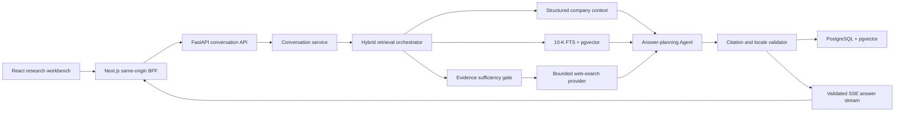

# Company Research Chat Design

Status: Approved design; written spec review pending
Date: 2026-07-14
Product: EquityLens
Phase: 4 — evidence-backed company research chat

## 1. Purpose

EquityLens will add a company-scoped research workbench where retail investors
can ask follow-up questions about financial statements, valuation context, core
businesses, and supply-chain relationships. Answers use a hybrid evidence
pipeline: structured company data, the latest indexed 10-K, published graph
evidence, and bounded web search selected by the Agent when the internal evidence
needs current or broader support.

The first release serves both signed guests and authenticated users. Guests
receive two messages per UTC day and one temporary company conversation retained
for seven days. Authenticated users receive ten messages per UTC day and can
create, rename, archive, and revisit multiple conversations per company.

## 2. Product decisions

The following decisions were approved during design review:

1. Chat uses an independent quota pool: two guest messages and ten authenticated
   messages per UTC day.
2. Guest conversations follow the signed guest principal and expire after seven
   days. Authenticated conversations use long-term persistence.
3. Each answer can use structured company summaries, financial metrics,
   supply-chain graph evidence, and the latest 10-K.
4. The Agent decides when web evidence is required. Official sources receive
   priority; trusted financial media and industry organizations supply secondary
   evidence with explicit source tier and publication date.
5. Answers follow four sections: direct conclusion, key evidence, risks and
   uncertainties, and sources.
6. Financial metrics, business cards, graph nodes, and graph relationships expose
   an “Ask EquityLens” action that attaches server-resolved context.
7. Authenticated users can maintain multiple conversations per company. Guests
   receive one temporary conversation per company.
8. Chat remains available while research evidence is incomplete. The workbench
   shows readiness and offers one-click actions for missing research jobs.
9. Desktop uses a 430 px right-side workbench. Mobile uses a near-full-height
   bottom sheet.
10. The implementation uses hybrid retrieval with PostgreSQL full-text search,
    pgvector, structured context, and an interchangeable web-search provider.

## 3. Scope

### 3.1 Included

- Company-scoped multi-turn conversations.
- Signed guest and authenticated-user ownership.
- Conversation creation, listing, rename, archive, and message history.
- Latest 10-K chunking, embeddings, full-text search, and hybrid ranking.
- Structured context from company, market, financial, intelligence, and graph
  services.
- Bounded Agent-selected web search with source classification.
- Structured, citation-bound answer plans.
- Server-Sent Events (SSE) for stages, sections, citations, completion, and
  errors.
- Independent chat quota reservation, consumption, and refund.
- English and Simplified Chinese UI and answers.
- Desktop, mobile, keyboard, screen-reader, and reduced-motion behavior.
- Docker and Vercel deployment contracts.
- Deterministic RAG evaluation fixtures and critical browser journeys.

### 3.2 Deferred phases

- Manual filing upload and private-document retrieval.
- 10-Q indexing and historical filing comparison.
- Cross-company chat threads.
- DCF calculation engine and editable valuation scenarios.
- Research notes, exports, sharing, and collaboration.
- Voice and multimodal chat.

The chat retrieval interfaces must accept additional document retrievers in a
later phase. The first database migration stores public SEC filing chunks only.

## 4. User experience

### 4.1 Entry points

The company dossier header exposes `Ask EquityLens`. The following components
also expose focused actions:

- Market and valuation cards: current price, market cap, EPS, trailing P/E, and
  forward P/E.
- Financial rows and cells: metric plus fiscal period.
- Core-business cards: claim ID and linked citation IDs.
- Supply-chain nodes: entity ID and graph snapshot ID.
- Supply-chain relationships: edge ID and graph snapshot ID.

An action sends only typed identifiers and the visible locale. The API resolves
the identifiers against the current company and published snapshot. Client labels
never become trusted evidence.

### 4.2 Desktop workbench

Opening chat changes the company page to a two-column layout. The dossier keeps
the flexible column and the chat workbench occupies 430 px. The workbench contains:

1. Company symbol, conversation title, history control, new-conversation action,
   and close action.
2. Evidence readiness for structured intelligence, 10-K index, graph, and web
   recency.
3. Suggested questions derived from available evidence categories.
4. The message list with stage status, structured answer sections, and citation
   chips.
5. Selected-context chips, automatic-web-search status, message composer, quota,
   and research disclaimer.

Authenticated history supports create, rename, and archive. Guest history exposes
the single active conversation and a clear action that archives it and starts a
fresh temporary conversation.

### 4.3 Mobile workbench

At viewport widths below 768 px, chat opens as a bottom sheet with a drag handle
and a maximum height of 92 dynamic viewport units. The sheet traps focus while
open, keeps the composer above the virtual keyboard, and restores focus to the
originating action when closed.

### 4.4 Empty and readiness states

Chat accepts a question whenever the company exists. Readiness reports four
independent resources:

| Resource | Ready state | Missing-state action |
|---|---|---|
| Structured intelligence | Published snapshot | Start company analysis |
| Filing text | Latest 10-K stored | Start company analysis |
| Filing index | Chunks and embeddings ready | Prepare 10-K for chat |
| Supply-chain graph | Published graph | Generate graph |

“Prepare 10-K for chat” is infrastructure indexing and consumes zero research or
chat quota. Company analysis and graph generation retain their existing Agent
quota rules. The user controls every quota-consuming readiness action.

## 5. Architecture



### 5.1 Frontend responsibilities

- Render workbench, conversation history, readiness, selected context, answer
  sections, citations, quotas, and retry states.
- Parse a closed SSE event union with exhaustive TypeScript handling.
- Preserve the active conversation ID per company in browser state.
- Send UUID identifiers for selected context and a unique `client_request_id`.
- Treat rendered model text as plain text or sanitized Markdown with links created
  exclusively from server citation objects.

### 5.2 Next.js BFF responsibilities

- Enforce the existing same-origin mutation boundary.
- Resolve and rotate the current access session or signed guest principal.
- Allowlist conversation and chat-readiness routes.
- Enforce a 16 KiB request-body limit for chat mutations.
- Forward the upstream `ReadableStream`, `content-type`, cache-control, event ID,
  retry, authentication, and guest-cookie headers incrementally.
- Preserve backpressure and abort the upstream request when the browser cancels.

The current research BFF buffers upstream responses with `arrayBuffer()`. Chat
requires a streaming branch that returns the upstream body directly.

### 5.3 FastAPI responsibilities

- Authorize every conversation against both company and current principal.
- Enforce input limits, idempotency, quota, retention, and conversation state.
- Retrieve internal evidence, decide whether web search is required, construct a
  strict answer plan, validate it, persist it, and stream it.
- Return ownership mismatches as the same 404 response used for absent resources.

### 5.4 Provider boundaries

The chat package defines protocols for:

- `EmbeddingProvider`
- `FilingChunkRepository`
- `StructuredContextProvider`
- `WebSearchProvider`
- `AnswerPlanningModel`
- `ChatQuotaRepository`

The first production web provider uses the OpenAI Responses API web-search tool
with `tool_choice="auto"`, an explicit query/page budget, and recorded source URLs.
Tests use deterministic providers. A later provider can replace OpenAI web search
through the same contract.

## 6. Persistence model

### 6.1 `CompanyConversation`

| Field | Type and rule |
|---|---|
| `id` | UUID primary key |
| `company_id` | Required FK to `company`, indexed |
| `user_id` | Nullable FK to `user`, indexed |
| `guest_principal_hash` | Nullable 64-character HMAC digest, indexed |
| `title` | Required, 1–120 characters |
| `locale` | `en-US` or `zh-CN` |
| `summary` | Nullable text for compact long-history context |
| `summary_through_message_id` | Nullable UUID checkpoint |
| `expires_at` | Required for guests, null for users |
| `archived_at` | Nullable soft-delete timestamp |
| `created_at`, `updated_at` | Timezone-aware timestamps |

A check constraint requires exactly one of `user_id` and
`guest_principal_hash`. A partial unique index on
`(company_id, guest_principal_hash) WHERE archived_at IS NULL` enforces one active
guest conversation per company. The create path archives an expired guest
conversation before inserting its successor. Authenticated users can create
multiple conversations. Repository methods exclude archived and expired
conversations by default.

### 6.2 `ConversationMessage`

| Field | Type and rule |
|---|---|
| `id` | UUID primary key |
| `conversation_id` | Required FK, indexed |
| `reply_to_message_id` | Nullable self-FK for assistant replies |
| `role` | `user` or `assistant` |
| `state` | `pending`, `planning`, `completed`, or `failed` |
| `content` | Required text; user content limited to 2,000 characters |
| `locale` | `en-US` or `zh-CN` |
| `client_request_id` | Nullable UUID; required for user messages |
| `context_selection` | Validated JSON identifiers for page context |
| `model_id` | Nullable model identifier for assistant messages |
| `evidence_coverage` | Nullable `complete`, `partial`, or `insufficient` |
| `error_code` | Nullable stable public error code |
| `attempt_count` | Zero for new assistant rows; incremented atomically on retry |
| `created_at`, `completed_at` | Timezone-aware timestamps |

`(conversation_id, client_request_id)` is unique. Assistant messages link to the
user message they answer. The repository returns messages in creation order and
supports cursor pagination.

### 6.3 `MessageCitation`

Each accepted citation is an immutable evidence snapshot:

| Field | Type and rule |
|---|---|
| `id` | UUID primary key |
| `message_id` | Required assistant-message FK, indexed |
| `ordinal` | Stable display order within the message |
| `source_kind` | `filing`, `financial`, `intelligence`, `graph`, or `web` |
| `source_id` | Nullable internal source UUID or stable metric key |
| `title` | Required, maximum 255 characters |
| `source_url` | HTTPS URL |
| `source_anchor` | Nullable page, section, graph edge, or metric period |
| `excerpt` | Required capped excerpt; 1,000 characters for filings and 600 for web |
| `published_at` | Nullable source publication timestamp |
| `retrieved_at` | Required retrieval timestamp |
| `source_tier` | `primary`, `trusted_secondary`, or `derived` |
| `verification` | `verified` or `supporting` |

A unique constraint on `(message_id, ordinal)` preserves stable ordering.

### 6.4 `FilingChunk`

| Field | Type and rule |
|---|---|
| `id` | UUID primary key |
| `company_id` | Required company FK, indexed |
| `filing_id` | Required filing FK, indexed |
| `section_id` | Required filing-section FK, indexed |
| `ordinal` | Chunk order within the section |
| `text` | Required source text |
| `token_count` | Positive integer |
| `content_hash` | SHA-256 digest |
| `chunk_schema_version` | Required version string |
| `embedding_model` | Required model string |
| `embedding` | pgvector `vector(1536)` |
| `created_at` | Timezone-aware timestamp |

`(filing_id, section_id, ordinal, chunk_schema_version, embedding_model)` is
unique. PostgreSQL adds an HNSW cosine index for `embedding` and a GIN index over
an English/simple text-search vector. Repository integration tests run against
PostgreSQL; deterministic unit tests use an in-memory ranker.

### 6.5 `WebSearchTrace`

The trace stores one sanitized row per search query: assistant message ID,
normalized query, search reason, result URL/title/date/tier metadata, selected
result IDs, private artifact key, artifact SHA-256, provider request ID, duration,
and tool-call ordinal. Raw page bodies live as compressed immutable objects under
the `chat-web/` storage prefix. Model chain-of-thought, credentials, and cookies
stay outside the trace and artifact.

### 6.6 `ChatQuotaLedger`

Chat uses its own ledger and UTC-day bucket. Each reservation records a unique
request UUID, principal kind, principal digest or user ID, date, conversation ID,
user-message ID, assistant-message ID, attempt number, reservation state, and
refund reason. The request UUID makes reserve, consume, refund, and repeated retry
requests idempotent.

## 7. Filing indexing and hybrid retrieval

### 7.1 Chunk creation

The indexing service reads existing `FilingSection` records for the latest 10-K.
It produces chunks with these locked defaults:

```text
target tokens: 700
overlap tokens: 100
minimum final chunk: 120 tokens
embedding model: text-embedding-3-small
embedding dimensions: 1536
chunk schema: filing-chunk.v1
```

Heading and source anchor are prepended as metadata, then stored separately from
chunk text. Re-running the index compares schema, model, and content hash and
reuses matching chunks. Changed sections replace their prior chunk set inside one
transaction.

The company-intelligence pipeline adds a durable `indexing` step after parsing.
Existing stored filings can start a dedicated zero-quota `filing_index` job from
chat readiness. RQ and Vercel Workflow implement the same job contract.

### 7.2 Query construction

The retrieval query combines:

- the current user question;
- resolved page-context labels;
- the previous eight messages;
- the conversation summary for older messages;
- the company name, ticker, and active locale.

The model rewrites this input into a standalone English filing query plus a
localized display query. The English query contains the company identity and
retains explicit fiscal periods, metrics, and entities, allowing Chinese user
questions to search an English 10-K consistently. Query-rewrite fixtures verify
the preservation of ticker, dates, metrics, and selected graph entities.

### 7.3 Hybrid ranking

The repository retrieves the top 20 full-text matches and top 20 cosine matches
for the current company and latest indexed 10-K. Reciprocal Rank Fusion with
`k=60` combines both lists. The orchestrator selects at most eight chunks, limits
each section to three chunks, and applies a 6,000-token filing evidence budget.

Structured context is retrieved independently and receives source objects for:

- the latest market snapshot and observation time;
- four annual periods plus TTM financial metrics;
- published intelligence claims and citations;
- published supply-chain nodes, edges, and exact evidence excerpts.

## 8. Agent and web-search policy

### 8.1 Search decision

Web search runs when any condition holds:

1. The question contains current-time intent such as “today”, “current”, “latest”,
   or “recent”.
2. Internal retrieval falls below the configured relevance, coverage, or source
   diversity threshold.
3. The planning Agent requests web evidence through the bounded search tool.

The deterministic conditions run before model tool choice. `tool_choice="auto"`
allows the Agent to request web support inside the remaining budget. A single user
message can execute at most three search queries and select at most eight pages.

### 8.2 Source tiers

1. `primary`: SEC, US government and regulator sources, company investor-relations
   pages, earnings releases, and official exchange notices.
2. `trusted_secondary`: configured financial publications, recognized industry
   associations, and established research institutions.
3. `derived`: EquityLens structured calculations and published graph snapshots.

Primary sources receive ranking preference. Secondary sources can support recent
events, industry context, and corroboration. Every selected web citation records
source tier, publication time when available, and retrieval time.

### 8.3 Web safety

Selected pages pass the existing graph-collector controls: HTTPS requirement,
scheme and port restrictions, DNS resolution and public-address checks, redirect
validation, content-type allowlist, response byte cap, decompression cap, per-host
pacing, and sanitized logging. Page content is delimited as untrusted evidence.
Instructions embedded in retrieved pages have zero tool or system authority.

OpenAI web-search output supplies candidate URLs and search metadata. EquityLens
fetches selected pages through its controlled collector before an exact excerpt
can become a verified citation. The collector stores a compressed immutable copy
in private Vercel Blob or S3-compatible storage, then records its artifact key and
hash on `WebSearchTrace`.

## 9. Answer planning and verification

The Agent produces a strict `ResearchAnswerPlan` before answer text is published:

```text
direct_conclusion: localized text + citation IDs
key_evidence[]: localized point + citation IDs
risks_and_uncertainties[]: localized point + citation IDs or explicit inference
sources[]: citation IDs in display order
evidence_coverage: complete | partial | insufficient
web_search_used: boolean
```

The validator enforces:

- every referenced citation exists in the approved evidence pack;
- every material number, current fact, and supply-chain claim carries support;
- filing excerpts match stored source text after whitespace normalization;
- web excerpts match the controlled fetched artifact;
- each citation belongs to the active company or is clearly external context;
- answer language matches the route locale;
- `insufficient` answers identify the missing evidence and avoid unsupported
  conclusions;
- inferences are labeled and cite their supporting premises.

The service retries one schema or citation-validation failure with compact
feedback. A second failure ends the message with a retryable public error and
refunds quota.

## 10. API contract

All endpoints use `/api/v1`.

```text
GET    /companies/{symbol}/chat-readiness
POST   /companies/{symbol}/chat-index/sync
GET    /companies/{symbol}/conversations
POST   /companies/{symbol}/conversations
GET    /conversations/{conversation_id}
PATCH  /conversations/{conversation_id}
DELETE /conversations/{conversation_id}
GET    /conversations/{conversation_id}/messages
POST   /conversations/{conversation_id}/messages
POST   /conversations/{conversation_id}/messages/{assistant_message_id}/retry
GET    /chat-quota
```

The guest create endpoint returns the existing active guest conversation when one
exists. Authenticated create always creates a new conversation. `DELETE` archives
the conversation and excludes it from default reads.

### 10.1 Message request

```json
{
  "client_request_id": "0f33c7af-01e4-4f10-899d-0dcc2152ce41",
  "content": "Why is Apple's gross margin higher than its peers?",
  "locale": "en-US",
  "context": [
    {
      "kind": "supply_chain_edge",
      "id": "da9d2fa8-1bf4-4dc5-a330-1692a2cda48a",
      "snapshot_id": "24c10316-03a9-4dcb-9f0e-a127ed6de684"
    }
  ]
}
```

The server resolves every context identifier and rejects stale or cross-company
objects with `CHAT_CONTEXT_INVALID`.

### 10.2 SSE response

The message endpoint returns `text/event-stream`. Each event contains a monotonic
event ID and JSON data.

| Event | Payload |
|---|---|
| `accepted` | user message ID, assistant message ID, conversation ID, quota |
| `stage` | `retrieval`, `web`, `compose`, or `verify`, plus localized status key |
| `section` | answer section kind and validated text delta |
| `citation` | immutable `MessageCitation` response |
| `complete` | complete assistant message, citations, coverage, quota |
| `error` | code, retryable flag, assistant message ID, quota |

The service sends an SSE comment heartbeat every 15 seconds during model or web
I/O. Headers include `Cache-Control: no-cache, no-transform` and
`X-Accel-Buffering: no`.

The answer plan and citations become durable before the first `section` event.
A client disconnect after durable completion can reload the completed message.
A cancellation before that boundary marks the assistant message failed and
refunds the reservation.

The retry endpoint accepts a fresh `client_request_id`, requires a failed and
retryable assistant message, increments `attempt_count`, and reuses the original
user message. A repeated retry ID returns the current attempt. The new attempt
reserves one unit after the prior attempt's refund, so a successful retry produces
one net consumed unit.

## 11. Quota and billing semantics

- Guest limit: 2 accepted user messages per UTC day.
- Authenticated limit: 10 accepted user messages per UTC day.
- Chat quota is independent from company-analysis and graph quotas.
- Reservation occurs after authorization and idempotency lookup, before retrieval.
- A validated answer with `complete`, `partial`, or `insufficient` coverage consumes
  one unit.
- Retrieval, required web search, model, validation, and pre-persistence transport
  failures refund the reservation exactly once.
- Replaying an existing initial or retry `client_request_id` returns the existing
  attempt state and quota with zero additional charge.
- Reloading, listing history, opening citations, and readiness indexing consume
  zero chat units.

The UI always displays the quota returned by the latest accepted, complete, or
error event.

## 12. Error handling

| Code | HTTP/event behavior | Quota |
|---|---|---|
| `CHAT_DAILY_QUOTA_EXCEEDED` | HTTP 429 before SSE | unchanged |
| `CHAT_CONVERSATION_NOT_FOUND` | HTTP 404 | unchanged |
| `CHAT_MESSAGE_INVALID` | HTTP 422 | unchanged |
| `CHAT_CONTEXT_INVALID` | HTTP 422 | unchanged |
| `CHAT_EVIDENCE_INDEXING` | Completed guidance response with readiness action | consumed |
| `CHAT_RETRIEVAL_FAILED` | Retryable SSE error | refunded |
| `CHAT_WEB_SEARCH_FAILED` | Retryable when current evidence is required | refunded |
| `CHAT_ANSWER_GENERATION_FAILED` | Retryable SSE error | refunded |
| `CHAT_ANSWER_VERIFICATION_FAILED` | Retryable SSE error | refunded |
| `CHAT_STREAM_CANCELLED` | Failed before durable completion | refunded |

Optional web supplementation can fail while strong internal evidence remains. In
that case the Agent completes with `partial` coverage and discloses the unavailable
current-source check.

## 13. Security and privacy

- All conversation repository queries include company and principal ownership.
- Ownership mismatches return 404 and omit existence details.
- Guest identifiers are stored as keyed HMAC digests. Raw signed cookie values stay
  outside persistence and logs.
- Guest cleanup deletes expired conversations, messages, citations, traces, and
  private `chat-web/` artifacts after seven days while retaining aggregate usage
  metrics.
- Authenticated chat-web artifacts follow the conversation retention policy and
  are deleted after conversation erasure and the configured recovery window.
- Login starts authenticated conversation space. Guest conversations retain their
  guest lifecycle and are excluded from automatic account migration.
- Message content receives length and Unicode normalization checks.
- Markdown rendering permits a narrow element allowlist and server-provided HTTPS
  citation links.
- Model prompts separate system policy, typed internal context, untrusted source
  evidence, and user text.
- Search traces store provider request IDs and sanitized source metadata. They
  exclude page bodies, secrets, cookies, and private model reasoning.
- Logs use request, conversation, and message IDs and omit message content by
  default.

## 14. Localization and accessibility

- Route locale controls UI copy and requested answer locale.
- Stored messages retain their creation locale; switching the page keeps prior
  text and localizes controls and future answers.
- Conversation titles are generated from the first question in its locale and can
  be renamed by authenticated users.
- Stage changes use `aria-live="polite"`.
- The workbench has a labeled dialog/region, deterministic heading order, and focus
  restoration.
- Conversation controls, context chips, citations, composer, send, retry, and close
  support keyboard operation.
- Reduced-motion mode removes drawer, stage, and section-delta animation.
- Citation links expose title, source tier, date, and destination.

## 15. Configuration

```dotenv
CHAT_GUEST_DAILY_LIMIT=2
CHAT_USER_DAILY_LIMIT=10
CHAT_GUEST_RETENTION_DAYS=7
CHAT_MAX_MESSAGE_CHARS=2000
CHAT_MAX_HISTORY_MESSAGES=8
CHAT_CHUNK_TARGET_TOKENS=700
CHAT_CHUNK_OVERLAP_TOKENS=100
CHAT_RETRIEVAL_CANDIDATES=20
CHAT_RETRIEVAL_MAX_CHUNKS=8
CHAT_RETRIEVAL_TOKEN_BUDGET=6000
CHAT_WEB_MAX_QUERIES=3
CHAT_WEB_MAX_PAGES=8
CHAT_WEB_SEARCH_PROVIDER=openai
CHAT_EMBEDDING_MODEL=text-embedding-3-small
CHAT_EMBEDDING_DIMENSIONS=1536
CHAT_MODEL_OVERRIDE=
CHAT_PROMPT_VERSION=company-chat.2026-07-14
CHAT_ANSWER_SCHEMA_VERSION=company-chat.v1
CHAT_INDEX_SCHEMA_VERSION=filing-chunk.v1
```

An empty `CHAT_MODEL_OVERRIDE` uses `RESEARCH_MODEL`.

## 16. Deployment

### 16.1 Docker

- PostgreSQL keeps pgvector and adds HNSW and full-text indexes.
- Redis/RQ runs zero-quota `filing_index` jobs.
- API workers stream SSE directly through the existing API port.
- Reverse-proxy documentation requires buffering disabled for the chat route.

### 16.2 Vercel

- The Python function keeps `maxDuration: 300`.
- A new Vercel Workflow trigger indexes stored filing sections durably.
- Python streaming sends SSE from FastAPI.
- The Next.js Route Handler forwards the upstream `ReadableStream` and disables
  transformations and caching.
- Function and BFF tests assert incremental delivery through two delayed chunks.

Vercel documents streaming for Python Functions and recommends streaming for AI
responses. FastAPI provides first-class SSE and streaming responses through async
generators. These primary sources support the selected transport.

## 17. Testing strategy

### 17.1 Backend unit and integration tests

- Model constraints, indexes, migrations, and cascade behavior.
- User and guest repository isolation, expiration, archive, and cursor pagination.
- Deterministic chunk boundaries, idempotent indexing, and changed-section
  replacement.
- PostgreSQL full-text and pgvector filtering by company and filing.
- Reciprocal Rank Fusion ordering, section diversity, and token budgets.
- Structured-context resolution for metric, business, graph node, and graph edge.
- Web-search triggers, budgets, tier classification, safe fetch, and prompt
  injection boundaries.
- Answer-plan schema, claim/citation binding, exact excerpt verification, locale,
  inference labels, and insufficient-evidence behavior.
- Independent quota reserve, consume, refund, replay, and UTC reset.
- SSE ordering, event IDs, heartbeat, completion durability, cancellation, and
  public error shapes.
- RQ and Vercel Workflow filing-index contract parity.

### 17.2 Frontend tests

- Closed SSE union parsing and reducer transitions.
- Workbench open/close, focus restoration, mobile sheet, and reduced motion.
- Conversation list create, rename, archive, and guest-singleton behavior.
- Evidence readiness and one-click job actions.
- Context chips from metrics, businesses, nodes, and edges.
- Suggested questions, stage announcements, structured sections, citations,
  quota updates, retry, and bilingual copy.
- BFF allowlist, origin, body limit, cookie rotation, streaming pass-through,
  cancellation, and error forwarding.

### 17.3 End-to-end journeys

1. A guest asks two completed AAPL questions and receives a localized quota error
   on the third.
2. A cached/replayed `client_request_id` consumes zero additional units.
3. A 10-K question uses filing citations and skips web search.
4. A current-event question triggers web search and displays tier/date metadata.
5. A graph relationship action opens chat with resolved edge context.
6. A retryable model or required-search failure refunds quota and retains the user
   question for retry.
7. A Chinese route streams Chinese stages and answer sections with exact sources.
8. An authenticated user creates, renames, archives, and reloads multiple company
   conversations.
9. A second user receives 404 for another user's conversation ID.
10. Mobile keyboard navigation opens a citation, closes the workbench, and restores
    focus.

### 17.4 RAG evaluation

The repository stores at least 20 fixed questions across revenue sources,
profitability, cash flow, valuation context, business segments, supply-chain
position, competitors, risk factors, and recent events. Each fixture records
required source categories and accepted facts. Evaluation checks:

- requested company and fiscal period;
- numerical consistency with structured data;
- citation presence and excerpt support;
- web-search decision correctness;
- evidence-coverage classification;
- response locale;
- absence of unsupported material claims.

## 18. Acceptance criteria

1. Guests can send two messages per UTC day and retain one company conversation
   for seven days.
2. Authenticated users can send ten messages per UTC day and manage multiple
   conversations per company.
3. Conversation data remains isolated by company and principal across every API.
4. The latest 10-K is indexed idempotently and retrieved through company-filtered
   hybrid search.
5. The Agent searches the web for current or internally unsupported questions and
   stays within the approved query and page budgets.
6. Every material number, current fact, and supply-chain claim in a completed
   answer has a valid citation or an explicit inference label.
7. The UI displays direct conclusion, key evidence, risks and uncertainties, and
   sources in the active locale.
8. SSE stage and answer events arrive incrementally through FastAPI, Next.js, local
   Docker, and Vercel Preview.
9. Retryable pre-completion failures refund quota exactly once, and replayed
   requests remain idempotent.
10. Company-page actions attach server-validated metric, business, graph-node, or
    graph-edge context.
11. Desktop, mobile, keyboard, screen-reader, and reduced-motion journeys pass.
12. Backend, frontend, migration, deployment-contract, E2E, and fixed RAG
    evaluation suites pass before release.

## 19. References

- Internal product design: [EquityLens US equity research platform design,
  2026-07-13, Chat and RAG sections](./2026-07-13-us-equity-research-platform-design.md)
- Internal product status: [EquityLens product status, 2026-07-14, Planned product
  work](../../product-status.md)
- External source: [FastAPI, accessed 2026-07-14, Server-Sent Events](https://fastapi.tiangolo.com/tutorial/server-sent-events/)
- External source: [FastAPI, accessed 2026-07-14, StreamingResponse](https://fastapi.tiangolo.com/advanced/custom-response/)
- External source: [Vercel, 2026-01-29, Streaming](https://vercel.com/docs/functions/streaming-functions)
- External source: [Vercel, 2026-01-30, Python runtime streaming](https://vercel.com/docs/functions/runtimes/python)
- External source: [OpenAI, accessed 2026-07-14, Developer quickstart — web
  search](https://platform.openai.com/docs/quickstart/make-your-first-api-request)
- External source: [OpenAI, accessed 2026-07-14, Responses streaming events](https://platform.openai.com/docs/api-reference/responses-streaming)
